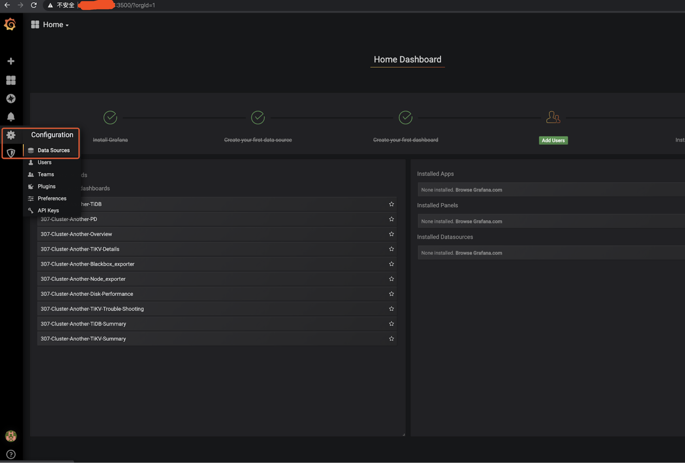
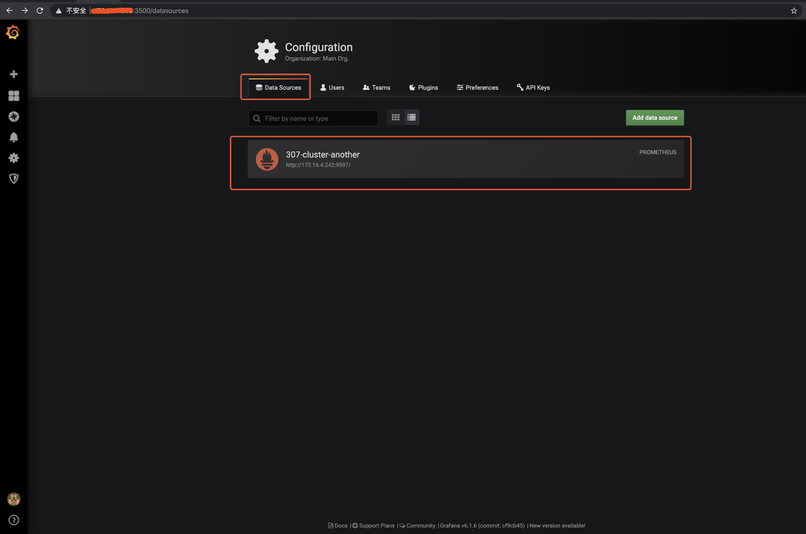
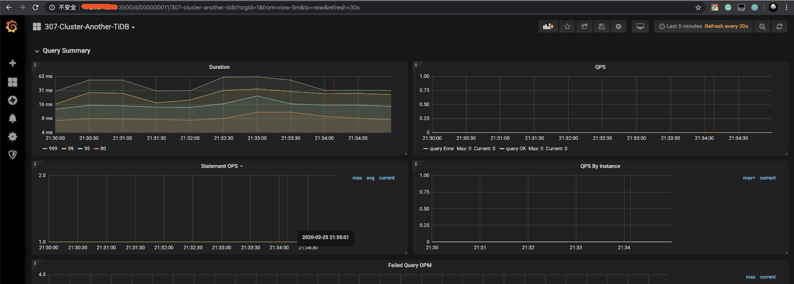
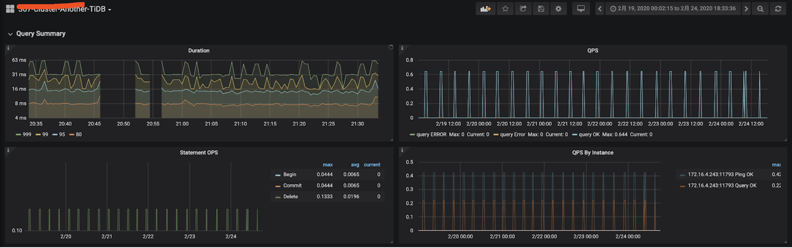

# Prometheus 等监控组件迁移

## 一、背景

TiDB Cluster 主要通过 Prometheus 方案解决线上监控、问题排查等问题，是 TiDB Cluster 自动化运维中必不可少的运维组件。Prometheus 的关联组件包括：Grafana、pushgateway、 node_exporter、blackbox_exporter 以及 altertmanager。在我们运维过程可能会遇到由于 机器故障、机房搬迁、机型替换等原因，需要迁移 Prometheus 服务，本文将描述如何对 Prometheus 监控数据进行迁移操作。

一般 node_exporter、blackbox_exporter 随集群其他节点部署，不需要单独迁移，需要迁移的通常为 Grafana + Prometheus + pushgateway + alertmanager。

## 二、操作前了解相关配置

Prometheus 监控数据迁移之前，先确认一下原监控是否有调整过重要的 IP、端口、目录、配置参数、版本等等信息。

### 2.1 查看 Prometheus 拓扑结构

- Prometheus 的拓扑结构主要通过 tidb-ansible/inventory.ini 来查看，端口、目录。

```yml
## Monitoring Part 
# prometheus and pushgateway servers
[monitoring_servers] -- 提供 Prometheus 和 Pushgateway 服务的节点 IP 和 端口
172.16.4.236 prometheus_port=9597

[grafana_servers] -- 提供 Grafana 服务的节点 IP 和 端口
172.16.4.236 grafana_port=3000

# node_exporter and blackbox_exporter servers
[monitored_servers] -- 提供被监控的节点的 node_exporter 和  blackbox_exporter servers 的服务 IP 和 端口
172.16.4.240
172.16.4.242
172.16.4.243
172.16.4.239
172.16.4.238
172.16.4.236
172.16.5.90
[alertmanager_servers] -- 提供 alertmanager 服务的告警服务 IP 和 端口
#172.16.4.236
```

### 2.2 了解 Prometheus 服务的配置情况

```yml
$ cat monitoring_servers.yml
---

prometheus_port: 9090
pushgateway_port: 9091

# How long to retain samples in the storage
prometheus_storage_retention: "30d"
```

### 2.3 了解 Grafana、Altermanager、blackbox exporter、nodebox exporter 服务的目录结构及配置情况。

- Grafana  服务的目录结构及配置

```yml
$ cat grafana_servers.yml
---

grafana_port: 3000

grafana_api_keys_dir: "{{ playbook_dir }}/conf/keys"
```

- node_exporter 和 blackbox_exporter 服务的目录及配置

```yml
$ 目录配置
$ cat monitored_servers.yml
---

node_exporter_log_dir: "{{ deploy_dir }}/log"
$端口配置
$ cat all.yml
... 忽略部分参数配置 ...
# default configuration for multiple host groups and roles
node_exporter_port: 9170
blackbox_exporter_port: 9715
kafka_exporter_port: 9307
... 忽略部分参数配置 ...
```

- alertmanager 服务的目录及配置

```yml
$ cat alertmanager_servers.yml
---

alertmanager_port: 9093
alertmanager_cluster_port: 9094
```

- 检查 tidb-ansible 下载版本是否为预期版本，以 v3.0.7 为例。这里注意一定要使用和集群一致的 ansible 版本，这是由于不同小版本 Prometheus 的一些抓取监控数据的度量值会有变化。

```yml
cd /tidb-ansible
$ git branch -v
* (no branch) f4902bb bump version to v3.0.7
```

## 三、操作步骤

### 3.1 更新 inventory.ini 配置，部署新的 Prometheus 等监控服务

- 在 inventory.ini 添加新的 prometheus 组件配置，同时注释掉原 prometheus 配置。如果对于端口和目录没有特殊要求的情况，只配置新 Prometheus 的 IP 就可以了。否则也需要在 inventory.ini 的位置添加对应的端口参数和目录参数（deploy_dir）。
- prometheus 和 pushgateway 一般都是一起部署的，所以默认将 pushgateway 也重新部署。
- grafana 和 alertmanager 可以选择迁移或者不迁移，如果迁移也要同步修改 IP

```yml
$ cat inventory.ini
---- 忽略上半部分代码 ------
[monitoring_servers] # 记得注释掉之前的 配置，同时也指定 Prometheus 和 pushgatewy 端口
#172.16.4.236 prometheus_port=9597
172.16.4.242 prometheus_port=9090 pushgateway_port=9091 deploy_dir=/home/tidb/deploy_3.0.7_new
[grafana_servers] # 记得注释掉之前的 配置，同时指定 grafana 的端口
#172.16.4.236 grafana_port=3000
172.16.4.242 grafana_port=3000
# node_exporter and blackbox_exporter servers
[monitored_servers] # 如果新节点确认是否已经配置在受监控的主机中。
172.16.4.240
172.16.4.242
172.16.4.243
172.16.4.239
172.16.4.238
172.16.4.236
172.16.5.90
[alertmanager_servers]
#172.16.4.236
172.16.4.242 alertmanager_port=9093 alertmanager_cluster_port=9093
---- 忽略上半部分代码 ------
```

- 部署开始

```shell
$# 配置节点系统配置
$ansible-playbook bootstrap.yml -l 172.16.4.242
$# 部署 prometheus
$ansible-playbook deploy.yml -l 172.16.4.242 -t prometheus
$# 部署 pushgateway
$ansible-playbook deploy.yml -l 172.16.4.242 -t pushgateway
$# 部署 grafana
$ansible-playbook deploy.yml -l 172.16.4.242 -t grafana
$# 部署 altermanager
$ansible-playbook deploy.yml -l 172.16.4.242 -t altermanager
$# 部署 node_exporter、blackbox_exporter ,如果该节点通过 tidb-ansible 已经部署过（TiKV、TiDB、PD），那么这两个组件已经部署过了，则不需要重复部署，当然 ansible 执行操作命令为幂等性的，既重复执行，最终的结果是一致的，所以重复执行也不会有什么影响。
$ansible-playbook deploy.yml -l 172.16.4.242 -t node_exporter,blackbox_exporter
```

3.2 启动 Proemtheus 服务

- 拉启 Proemtheus 和 pushgateway 服务

```shell
$# 确保已经停掉原 prometheus 和 pushgateway
$# 启动 prometheus 和 pushgateway
$ansible-playbook start.yml -l 172.16.4.242 -t prometheus
$ansible-playbook start.yml -l 172.16.4.242 -t pushgateway
$ansible-playbook start.yml -l 172.16.4.242 -t grafana
$ansible-playbook start.yml -l 172.16.4.242 -t altermanager
$ansible-playbook start.yml -l 172.16.4.242 -t node_exporter,blackbox_exporter
```

- 滚动整个监控集群

```yml
$# 滚动整个监控集群
$ansible-playbook rolling_update_monitor.yml
```

- 配置 Grafana -- 如果 Grafana 也已经迁移，则跳过此步骤

  - 设置中找到 Data Sources



  - 选择要调整的 Data Sources



  - 将 “HTTP” 的 “URL” 进行调整设置为最新的 Prometheus 的监控平台 地址配置 “172.16.4.242:9090” ，并且点击 “save & test” ，保存。


## 四、操作后 Check 监控项



## 五、迁移可能会涉及的 FAQ

### 5.1 如何导入原 Prometheus 的监控数据

如果希望保留原 Prometheus 的监控数据，可以将其导入到新监控中，有全量导入和截取一段导入两种方式。

- 全量导出 Prometheus 数据
  - 全量数据正常会非常大，尤其是保留启动参数配置了 storage.tsdb.retention="30d" 保留 30 天的情况，可以通过 tar 方式压缩

```shell
$# 通过 ssh 进入 原 Prometheus 服务节点
$ssh {prometheus-ip}
$# 进入 Prometheus 的部署目录下的 scripts 目录
$cd ${deploy_dir}/scripts
$# 查看 Prometheus 的启动配置项，“--storage.tsdb.path” 配置就是存储 prometheus 监控数据文件的目录
$cat run_prometheus.sh
#!/bin/bash
set -e
ulimit -n 1000000

DEPLOY_DIR=/home/tidb/deploy_3.0.7
cd "${DEPLOY_DIR}" || exit 1

# WARNING: This file was auto-generated. Do not edit!
#          All your edit might be overwritten!
exec > >(tee -i -a "/home/tidb/deploy_3.0.7/log/prometheus.log")
exec 2>&1

exec bin/prometheus \
    --config.file="/home/tidb/deploy_3.0.7/conf/prometheus.yml" \
    --web.listen-address=":9597" \
    --web.external-url="http://172.16.4.236:9597/" \
    --web.enable-admin-api \
    --log.level="info" \
    --storage.tsdb.path="/home/tidb/deploy_3.0.7/prometheus2.0.0.data.metrics" \
    --storage.tsdb.retention="30d"
$cd  /home/tidb/deploy_3.0.7/
$ls -lart prometheus2.0.0.data.metric
$total 4
drwxr-xr-x. 11 tidb tidb  150 Dec 20 12:04 ..
-rw-r--r--.  1 tidb tidb    0 Dec 20 13:57 lock
drwxr-xr-x.  3 tidb tidb   68 Feb 25 16:04 01DZJF2G2BYG7JW0AXW3AZ5WSS
drwxr-xr-x.  3 tidb tidb   68 Feb 25 16:04 01DZR8F29SV2TNQ80Y1CEJ2H2K
drwxr-xr-x.  3 tidb tidb   68 Feb 25 16:04 01DZY1VT0K4NVQPBY51Z9Q9F4M
drwxr-xr-x.  3 tidb tidb   68 Feb 25 16:04 01E03V8DZRMSYX1EN98VDMKND1
drwxr-xr-x.  3 tidb tidb   68 Feb 25 16:04 01E09MN09R3T9BB8RWTVBTV85F
drwxr-xr-x.  3 tidb tidb   68 Feb 25 16:04 01E0FE1HVQ5GNDBYN1K16C1D0R
drwxr-xr-x.  3 tidb tidb   68 Feb 25 16:04 01E0N7E8VXC6TVBYXFT3JE160D
drwxr-xr-x.  3 tidb tidb   68 Feb 25 16:04 01E0V0TTKJ4BT3TX0WK581N04E
drwxr-xr-x.  3 tidb tidb   68 Feb 25 16:04 01E10T7GWVAXD91FVZ4RH2R0K8
drwxr-xr-x.  3 tidb tidb   68 Feb 25 16:04 01E16KM1TE5R4V2GHPXE3G0FYN
drwxr-xr-x.  3 tidb tidb   68 Feb 25 16:04 01E1CD0N9DZEJBP0V6T2H88J0R
drwxr-xr-x.  3 tidb tidb   68 Feb 25 16:04 01E1J6DAM2BJTG1WVM1ETTJ1VV
drwxr-xr-x.  3 tidb tidb   68 Feb 25 16:04 01E1QZSYNC18JXTYMTD8NK3WRC
drwxr-xr-x.  3 tidb tidb   68 Feb 25 16:04 01E1SXK95Y7TC24KMQGFCE789J
drwxr-xr-x.  3 tidb tidb   68 Feb 25 16:04 01E1VVCJDV9F6MVW1XQ0NB0KRA
drwxr-xr-x.  3 tidb tidb   68 Feb 25 16:04 01E1VVCPT5D79304RW41GDMTYS
drwxr-xr-x   3 tidb tidb   68 Feb 25 16:04 01E1XMAN6TKGTWV2SMWCKY7P4J
drwxr-xr-x. 20 tidb tidb 4096 Feb 25 16:04 .
drwxr-xr-x.  3 tidb tidb   95 Feb 25 16:10 wal
$查看 prometheus2.0.0.data.metrics 大小
$du -sh prometheus2.0.0.data.metrics
8.9G	prometheus2.0.0.data.metrics/
$# 压缩监控数据文件，时间较长建议放在后台执行。
$tar -cvzf prometheus2.0.0.data.metrics.tar.gz prometheus2.0.0.data.metrics/
```

- 截取一段 Prometheus 数据导出
  - 可以直接按照创建日期直接截取一部分监控数据文件
```shell
$ cd 01E1VVCJDV9F6MVW1XQ0NB0KRA
$ ls -lart
total 3868
drwxr-xr-x.  2 tidb tidb      20 Feb 24 23:00 chunks
-rw-r--r--.  1 tidb tidb 3945252 Feb 24 23:00 index
-rw-r--r--.  1 tidb tidb       9 Feb 24 23:00 tombstones
-rw-r--r--   1 tidb tidb     305 Feb 25 16:04 meta.json
drwxr-xr-x.  3 tidb tidb      68 Feb 25 16:04 .
drwxr-xr-x. 20 tidb tidb    4096 Feb 25 16:04 ..
$ cd ../01E1SXK95Y7TC24KMQGFCE789J
$ ls -lart
total 14836
drwxr-xr-x.  2 tidb tidb       20 Feb 24 05:00 chunks
-rw-r--r--.  1 tidb tidb 15179425 Feb 24 05:00 index
-rw-r--r--.  1 tidb tidb        9 Feb 24 05:00 tombstones
-rw-r--r--   1 tidb tidb      929 Feb 25 16:04 meta.json
drwxr-xr-x.  3 tidb tidb       68 Feb 25 16:04 .
drwxr-xr-x. 20 tidb tidb     4096 Feb 25 16:04 ..
$ cd ../01E1QZSYNC18JXTYMTD8NK3WRC
$ ls -lart
total 37744
drwxr-xr-x.  2 tidb tidb       34 Feb 23 11:00 chunks
-rw-r--r--.  1 tidb tidb 38636384 Feb 23 11:00 index
-rw-r--r--.  1 tidb tidb        9 Feb 23 11:00 tombstones
-rw-r--r--   1 tidb tidb     1523 Feb 25 16:04 meta.json
drwxr-xr-x.  3 tidb tidb       68 Feb 25 16:04 .
drwxr-xr-x. 20 tidb tidb     4096 Feb 25 16:04 ..
$ cd ../01E1J6DAM2BJTG1WVM1ETTJ1VV
$ ls -lat
total 37024
drwxr-xr-x. 20 tidb tidb     4096 Feb 25 16:04 ..
drwxr-xr-x.  3 tidb tidb       68 Feb 25 16:04 .
-rw-r--r--   1 tidb tidb     1523 Feb 25 16:04 meta.json
-rw-r--r--.  1 tidb tidb        9 Feb 21 05:00 tombstones
-rw-r--r--.  1 tidb tidb 37896841 Feb 21 05:00 index
drwxr-xr-x.  2 tidb tidb       34 Feb 21 05:00 chunks
$ 将导出数据打包备份
$ tar -cvzf prometheus2.0.0.data.metrics_2125.tar.gz 01E1VVCJDV9F6MVW1XQ0NB0KRA 01E1SXK95Y7TC24KMQGFCE789J 01E1QZSYNC18JXTYMTD8NK3WRC 01E1J6DAM2BJTG1WVM1ETTJ1VV
```

  - 可以通过一些开源工具来截取指定的监控数据文件

    - 工具下载

```shell
$wget --http-user=TiDB-DBA --http-password=areyouhungry http://42.159.80.36:8080/soft/export-data
$ chmod 755 export-data
```

    - 时间戳转换 https://tool.lu/timestamp/


    - 加入我们希望截取 2020-02-21 00:00:01 到 2020-02-25 23:59:59 时间的段的监控数据操作

```shell
$ 导出监控数据操作
$ ./export-data dump --dump-dir=./ --min-time=1582214461000 --max-time=1582646399000 /home/tidb/deploy_3.0.7/prometheus2.0.0.data.metrics
$ 查看导出结果
$ ls -lart
total 12604
-rwxr-xr-x   1 tidb tidb 12906459 Feb 25 17:07 export-data
drwxr-xr-x.  5 tidb tidb       51 Feb 25 17:08 ..
drwxrwxr-x   3 tidb tidb       68 Feb 25 17:29 01E1J6DAM2BJTG1WVM1ETTJ1VV
drwxrwxr-x   3 tidb tidb       68 Feb 25 17:29 01E1SXK95Y7TC24KMQGFCE789J
drwxrwxr-x   3 tidb tidb       68 Feb 25 17:29 01E1QZSYNC18JXTYMTD8NK3WRC
drwxrwxr-x   3 tidb tidb       68 Feb 25 17:29 01E1VVCJDV9F6MVW1XQ0NB0KRA
drwxrwxr-x   3 tidb tidb       68 Feb 25 17:29 01E1XMAN6TKGTWV2SMWCKY7P4J
drwxrwxr-x   3 tidb tidb       68 Feb 25 17:29 01E1VVCPT5D79304RW41GDMTYS
drwxrwxr-x   3 tidb tidb       68 Feb 25 17:29 01E1XS63NHQMH82X4NNJ0J2PAN
drwxrwxr-x   3 tidb tidb       68 Feb 25 17:29 01E1XTW4B4HQGVGB25VEDP8W0T
drwxrwxr-x  10 tidb tidb      297 Feb 25 17:29 .
$ 查看导出大小
$ du -sh *
713M	01E1J6DAM2BJTG1WVM1ETTJ1VV
745M	01E1QZSYNC18JXTYMTD8NK3WRC
256M	01E1SXK95Y7TC24KMQGFCE789J
17M	01E1VVCJDV9F6MVW1XQ0NB0KRA
263M	01E1VVCPT5D79304RW41GDMTYS
6.6M	01E1XMAN6TKGTWV2SMWCKY7P4J
664K	01E1XS63NHQMH82X4NNJ0J2PAN
123M	01E1XTW4B4HQGVGB25VEDP8W0T
13M	export-data
$ 将导出数据打包备份
$ i=`ls |grep -v "export-data"`
$ echo $i
01E1J6DAM2BJTG1WVM1ETTJ1VV 01E1QZSYNC18JXTYMTD8NK3WRC 01E1SXK95Y7TC24KMQGFCE789J 01E1VVCJDV9F6MVW1XQ0NB0KRA 01E1VVCPT5D79304RW41GDMTYS 01E1XMAN6TKGTWV2SMWCKY7P4J 01E1XS63NHQMH82X4NNJ0J2PAN 01E1XTW4B4HQGVGB25VEDP8W0T
$ tar -cvzf prometheus_2125.tar.gz ${i}
```

- 将监控数据导入到目标节点

```shell
$# 原节点
$scp prometheus_2125.tar.gz tidb@172.16.4.242:/home/tidb/deploy_3.0.7_new/prometheus2.0.0.data.metrics
$# 查看新节点的监控数据存放位置，在进程中会有 “--storage.tsdb.path” 信息
$$ ps -ef |grep prometheus|grep "storage.tsdb.path"
tidb      2118     1  6 Feb25 ?        01:18:00 bin/prometheus --config.file=/home/tidb/deploy_3.0.7_new/conf/prometheus.yml --web.listen-address=:9597 --web.external-url=http://172.16.4.242:9597/ --web.enable-admin-api --log.level=info --storage.tsdb.path=/home/tidb/deploy_3.0.7_new/prometheus2.0.0.data.metrics --storage.tsdb.retention=30d
$# 新节点，目标目录解压
$cd /home/tidb/deploy_3.0.7_new/prometheus2.0.0.data.metrics
$tar -xvf prometheus_2125.tar.gz
```

- 通过 Grafana 验证数据是否导入成功 - TiDB 监控看到的 2.21-2.25 的监控数据



### 5.2 tidb-ansible 中使用的 Prometheus 组件的版本信息和默认配置的情况查看

1. 版本信息

> **注意**
> 
> 目前 Prometheus 版本和 TIDB Cluster 版本，TiDB 版本都是按照 Release notes 里面的版本打版的，基本上每个独立的小版本的 Prometheus 抓取的监控度量数据都有一些变化，所以建议是完全按照同版本的 tidb-ansible 新建新的 prometheus 服务。

- Prometheus 及其他组件版本

```shell
$ pwd
/tidb-ansible/roles/local/templates
$ cat binary_packages.yml.j2
---

third_party_packages:
  - name: prometheus
    version: 2.8.1
    url: "https://github.com/prometheus/prometheus/releases/download/v2.8.1/prometheus-2.8.1.linux-amd64.tar.gz"
  - name: alertmanager
    version: 0.17.0
    url: "https://github.com/prometheus/alertmanager/releases/download/v0.17.0/alertmanager-0.17.0.linux-amd64.tar.gz"
  - name: node_exporter
    version: 0.17.0
    url: "https://github.com/prometheus/node_exporter/releases/download/v0.17.0/node_exporter-0.17.0.linux-amd64.tar.gz"
  - name: blackbox_exporter
    version: 0.12.0
    url: "https://github.com/prometheus/blackbox_exporter/releases/download/v0.12.0/blackbox_exporter-0.12.0.linux-amd64.tar.gz"
  - name: pushgateway
    version: 0.7.0
    url: "https://github.com/prometheus/pushgateway/releases/download/v0.7.0/pushgateway-0.7.0.linux-amd64.tar.gz"
  - name: grafana
    version: 6.1.6
    url: "https://dl.grafana.com/oss/release/grafana-6.1.6.linux-amd64.tar.gz"


third_party_packages_under_gfw:
  - name: prometheus
    version: 2.8.1
    url: "https://download.pingcap.org/prometheus-2.8.1.linux-amd64.tar.gz"
  - name: alertmanager
    version: 0.17.0
    url: "http://download.pingcap.org/alertmanager-0.17.0.linux-amd64.tar.gz"
  - name: node_exporter
    version: 0.17.0
    url: "http://download.pingcap.org/node_exporter-0.17.0.linux-amd64.tar.gz"
  - name: pushgateway
    version: 0.7.0
    url: "http://download.pingcap.org/pushgateway-0.7.0.linux-amd64.tar.gz"
  - name: grafana
    version: 6.1.6
    url: "https://download.pingcap.org/grafana-6.1.6.linux-amd64.tar.gz"
  - name: blackbox_exporter
    version: 0.12.0
    url: "http://download.pingcap.org/blackbox_exporter-0.12.0.linux-amd64.tar.gz"

---- 忽略下半部分代码 ------
```

- TiDB 版本

```shell
$ cat inventory.ini |grep version
tidb_version = v3.0.7
```

2. 配置文件

- Prometheus.yml 文件会配置 Grafana、pushgateway、 node_exporter、blackbox_exporter 以及 altermanager 的 IP 和 端口信息，一般通过 tidb-ansible 来完成所有的配置，可以自动配置，以下为具体的配置文件和配置参数。
  - prometheus.yml

```shell
$ cat run_prometheus.sh|grep "config.file"
    --config.file="/home/tidb/deploy_3.0.7/conf/prometheus.yml" \
```

- Grafana 会单独有一个数据源的 json 配置，用来读取 Prometheus 的监控数据
  - grafana 的数据源配置

```shell
$ pwd
/home/tidb/deploy_3.0.7/data.grafana
$ cat data_source.json
{
    "name":"307-cluster-another",
    "type":"prometheus",
    "access":"proxy",
    "url":"http://172.16.4.236:9597/",
    "basicAuth":false
```

3. 监控数据

- 监控数据采用的 binary 格式的，建议不要随意修改，一个完整的监控数据文件目录包括 chunks 目录、index、tombstones、meta.json 文件。

```shell
$ ls -lart
total 34396
drwxr-xr-x.  2 tidb tidb       34 Jan 27 11:00 chunks
-rw-r--r--.  1 tidb tidb 35205230 Jan 27 11:00 index
-rw-r--r--.  1 tidb tidb        9 Jan 27 11:00 tombstones
drwxr-xr-x. 21 tidb tidb     4096 Feb 25 17:00 ..
-rw-r--r--   1 tidb tidb     1523 Feb 25 17:35 meta.json
drwxr-xr-x.  3 tidb tidb       68 Feb 25 17:35 .
```

4. 监控模版

- 如 3.1 所说，建议跟 TiDB Cluster 版本要匹配，不然可能会出现监控数据无法使用的情况。

```shell
$ cat /home/tidb/deploy_3.0.7/conf/prometheus.yml
---
global:
  scrape_interval:     15s # By default, scrape targets every 15 seconds.
  evaluation_interval: 15s # By default, scrape targets every 15 seconds.
  # scrape_timeout is set to the global default (10s).
  external_labels:
    cluster: '307-cluster-another'
    monitor: "prometheus"

# Load and evaluate rules in this file every 'evaluation_interval' seconds.
rule_files:
  - 'node.rules.yml'
  - 'blacker.rules.yml'
  - 'bypass.rules.yml'
  - 'pd.rules.yml'
  - 'tidb.rules.yml'
  - 'tikv.rules.yml'
---- 忽略下半部分代码 ------
```