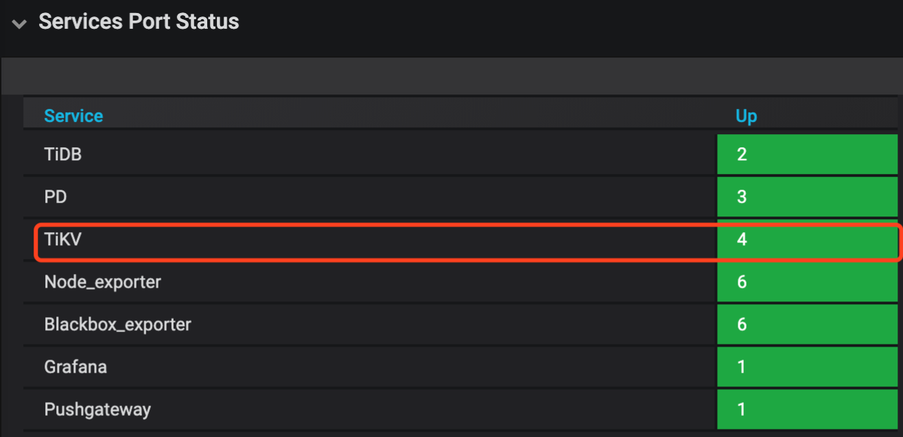

#前言

版本 | 发表时间 | 发表人 | 主要修改内容
---- | ---- | ---- |----
V1.0 | 20200301 | PingCAP  UE team | 第一版，有错误修改请邮件给 support@pingcap.com


## TiDB 运维手册 - SOP 系列 1.0 介绍
TiDB 作为一款新一代的分布式关系型数据库，在日常运维上会和传统的关系型数据库有一定的区别，用户生态团队给大量 TiDB 提供了社区技术支持，我们根据大家经常提问的一些运维问题，进行收敛，会逐步推出《TiDB 运维手册》，前期计划包括 SOP、POC、Case Stuady 三个系列。

本期是 SOP（`Standard Operation Procedure`） 系列，是第一个版本，一共包括 10 个主题，每个主题我们都会通过标准的 step by step 步骤，来完整实现对某一个常见运维目标的操作。希望对大家有用，如果在操作过程遇到什么问题、或者你有什么需求，可以通过邮件、或者 AskTUG 进行讨论与反馈（ https://asktug.com/t/topic/33145 ），我们会定期 review 、修正内容、增加新的主题，进行版本迭代。

> V1.0 目录:

    SOP 之 -- 线上集群升级
    SOP 之 -- 线上集群扩缩容
    SOP 之 -- 现有集群 TiKV 如何从单实例部署调整为多实例部署
    SOP 之 -- 现有集群如何从单机房调整为跨机房部署
    SOP 之 -- 关机临时维护某线上主机
    SOP 之 -- 在线表结构变更（Online DDL）
    SOP 之 -- 线上集群开启 / 关闭 Binlog 
    SOP 之 -- Prometheus 监控迁移流程
    SOP 之 -- 如何修改 TiDB/TiKV/PD IP
    SOP 之 -- 如何修改 TiDB/TiKV/PD 端口


# 01 Release-2.1 升级到 Release-3.0 线上集群升级
> 李仲舒  2020 年 2 月 10 日


## 一、背景 / 目的

分布式数据库集群运维过程有一定的复杂性和繁琐性，3.0 版本是目前被广泛使用的版本，相比 2.1 有大幅度增加性能，以及很多新增的功能和特性，整体架构、配置也有较大的优化。该篇根据广大用户的升级经验，尽可能将 Release-2.1 升级到 Release-3.0 的准备工作、升级过程中注意事项、升级后重点关注列举详细，做到防患于未然。为 Release-3.0 版本的优秀特性和产品性能在业务场景中广泛使用提供文档依托。  


适用人群默认为熟悉 2.1 版本的使用，但是没有做过大版本升级。

## 二、操作前的 Check 项

### 2.1 备份原集群修改过的 TiDB、TiKV 和 PD 参数

> 创建临时目录，备份升级前的参数配置

```shell
mkdir -p /tmp/tidb_update_3.0/conf
mkdir -p /tmp/tidb_update_3.0/group_vars
```

> 确认并备份 tidb-ansible/conf/tidb.yml 中的参数

```shell
$cat tidb.yml |grep -v "#" |grep -v ^$ > /tmp/tidb_update_3.0/conf/tidb.yml
$cat /tmp/tidb_update_3.0/conf/tidb.yml
... 配置展示省略 ...
```

> 确认并备份 tidb-ansible/conf/tikv.yml 中的参数

```shell
$cat tikv.yml |grep -v "#" |grep -v ^$ > /tmp/tidb_update_3.0/conf/tikv.yml
$cat /tmp/tidb_update_3.0/conf/tikv.yml
... 配置展示省略 ...
```

> 确认并备份 tidb-ansible/conf/pd.yml 中的参数

```shell
$cat pd.yml |grep -v "#" |grep -v ^$ > /tmp/tidb_update_3.0/conf/tidb.yml
$cat /tmp/tidb_update_3.0/conf/pd.yml
... 配置展示省略 ...
```

> 确认并备份 PD 集群中 etcd 记录的 PD 配置信息

```shell
$cd tidb-ansible/resource/bin/
$./pd-ctl -u "http://{pd-ip}:{pd_client_port}" config show all > /tmp/tidb_update_3.0/conf/pd.json
$cat /tmp/tidb_update_3.0/conf/pd.json
... 配置展示省略 ...
```

> 确认并备份 TiDB、TiKV、PD、Grafana、Prometheus 等组件的组参数的变化，尤其是端口的变化

```shell
$cd tidb-ansible/group_vars
$ll |awk '{print $9}'|grep -v ^$
alertmanager_servers.yml
all.yml
drainer_servers.yml
grafana_servers.yml
importer_server.yml
lightning_server.yml
monitored_servers.yml
monitoring_servers.yml
pd_servers.yml
pump_servers.yml
tidb_servers.yml
tikv_servers.yml
$cp *.yml /tmp/tidb_update_3.0/group_vars/
```

## 三、升级前的注意事项

### 3.1  查看 TiDB 的 Release Notes

以 v3.0.9 [Release Notes](https://pingcap.com/docs-cn/stable/releases/3.0.9/) 为例，通过Release Notes了解做了那些优化或者修复了哪些 bug。

### 3.2 升级 3 个注意、2 个不支持、1 个用户

- 注意通知业务，升级期间可能会有偶尔的性能抖动，PD leader 升级可能会有 3s 的影响；

- 注意预估升级时间 = tikv 个数 \* 5 min（默认是 transfer leader 时间） + 10 min，滚动升级 TiKV 时间较长；

- 注意通知业务升级过程禁止操作 DDL，最好过一次完整的数据冷备份，通过 MyDumper 导出业务库；

- 整个升级过程不支持版本回退，目前未出现升级失败需要回退案例;

- 升级过程中不支持 DDL 操作，否则会有未定义问题，最终导致升级异常，影响业务；

- 升级操作通过中控机的 TiDB 管理用户完成，默认是 “tidb” 用户。

## 四、操作步骤

### 4.1 下载最新版的 v3.0.x 版本的 tidb-ansible

对应的 TAG 可以查看 Github 中的[ tidb-ansible 项目](https://github.com/pingcap/tidb-ansible/releases/tag/v3.0.9)，以 v3.0.9 为例，注意设置目录别名 `“tidb-ansible-v3.0.9”`

```shell
git clone -b v3.0.9 https://github.com/pingcap/tidb-ansible.git tidb-ansible-v3.0.9
```

tidb-ansible-v3.0.9 几个特殊的地方：

- 关于新增的 `excessive_rolling_update.yml` 和 `rolling_update.yml` 的关系。
  - 如果部署采用 （默认）systemd 模式 ，使用 `excessive_rolling_update.yml` 来进行滚动升级操作，原因是涉及到 [PD 滚动升级](https://github.com/pingcap/tidb-ansible/blob/v3.0.9/excessive_rolling_update.yml#L208-L211)（以 v3.0.9 为例）的代码变动，该脚本仅本次升级使用一次，以后再次升级到后续版本均由 `rolling_update.yml` 来完成。

     ```shell
     $ cat inventory.ini|grep supervision
     
     # process supervision, [systemd, supervise]
     
     process_supervision = systemd
     ```

  - 如果采用 supervise 模式，依然使用 rolling\_update.yml 来进行滚动升级操作。

     ```shell
     $ cat inventory.ini|grep supervision
     # process supervision, [systemd, supervise]
     process_supervision = supervise
     ```

- 新增 [config check](https://github.com/pingcap/tidb-ansible/blob/v3.0.9/rolling_update.yml#L57-L76) （以 v3.0.9 为例）,主要检查参数配置语法正确性。

```yml
## 代码块
- name: Pre-check PD configuration
  hosts: pd_servers[0]
  tags:
    - pd
  roles:
    - check_config_pd

- name: Pre-check TiKV configuration
  hosts: tikv_servers[0]
  tags:
    - tikv
  roles:
    - check_config_tikv

- name: Pre-check TiDB configuration
  hosts: tidb_servers[0]
  tags:
    - tidb
  roles:
    - check_config_tidb
```

### 4.2 更新 ansible 及依赖组件版本

```shell
# 验证版本是否符合要求
# 版本要求
$cat ./requirements.txt
ansible==2.7.11
jinja2>=2.9.6
jmespath>=0.9.0
# 检查版本
$ansible --version
$pip show jinja2
$pip show jmespath
# 卸载重新安装
# 卸载组件
$sudo pip uninstall ansible -y
$sudo pip uninstall jinja2 -y
$sudo pip uninstall jmespath -y
# 安装组件
$sudo pip install -r ./requirements.txt
```

### 4.3  编辑新 ansible 的 inventory.ini 和 配置

参考原始 inventory.ini 编辑新 inventory.ini 

```shell
$cd tidb-ansible-v3.0.9
# 按照 tidb-ansible/inventory.ini 配置
$vi inventory.ini
```

> 注意
> 
> 不要直接 cp 或者 mv 方式覆盖新的 inventory.ini 文件，建议将备份的原 tidb-ansible 的 inventory.ini 的配置参数通过复制、黏贴的方式将参数填写到新的 tidb-ansible 的 inventory.ini 配置文件中。另外注意以下几点：
- TiKV 单机多实例 
   -  TiKV 多实例部署时，必须添加 [tikv\_status\_port](https://pingcap.com/docs-cn/stable/how-to/upgrade/from-previous-version/#%E7%BC%96%E8%BE%91-tidb-%E9%9B%86%E7%BE%A4%E7%BB%84%E4%BB%B6%E9%85%8D%E7%BD%AE%E6%96%87%E4%BB%B6) 参数，同机上的多个实例注意区分端口，否则会造成监控缺失。
【功能介绍】监控数据到 Prometheus 从 push 模式调整为 pull 模式，TiKV 的启动脚本 `run_tikv.sh` 需要配置 `tikv_status_port`，需要在 inventory.ini 的 `[tikv_servers]` 主机组下的目标实例配置中添加参数 `tikv_status_port`，通过滚动升级才会将参数写入到 `run_tikv.sh` 中。

      ```yml
      vi tidb-ansible/inventory.ini
      ...省略上部分参数... 
      [tikv_servers]
      TiKV1-1 ansible_host=172.16.10.4 deploy_dir=/data1/deploy       tikv_port=20171 tikv_status_port=20181 labels="host=tikv1"
      TiKV1-2 ansible_host=172.16.10.4 deploy_dir=/data2/deploy       tikv_port=20172 tikv_status_port=20182 labels="host=tikv1"
      ...省略下部分参数...
      ```

   -  label 设置是否正确：

      - `[tikv_servers]` 主机组配置中同台主机多实例设置为相同的 host label ；

      - `[pd_servers:vars]` 下的 `locations_labels` 是否正确设置为 `locations_labels = [“host”]`；

- `enable_binlog` 是否开启  ,如果设置为 `True` ，升级过程中 Pump Server 会跟滚动升级操作一起升级，Drainer Server 需要单独完成升级操作。

- `deploy_dir` 和指定的参数（例如：端口、IP、别名）配置是否正确。

### 4.4  编辑 `group_vars` 文件

> **注意**
>
>不要直接 cp 或者 mv 方式覆盖新的 `group_vars` 目录下的 yml 文件，建议将原来 `group_vars` 下的 yml 文件分别和新的 `group_vars` 目录下的 yml 文件的配置参数对比，如果之前有做过参数调整，修改新的配置文件；如果默认的配置，可以忽略这个步骤。  

```shell
#按照 /tmp/tidb_update_3.0/group_vars 手动修改过的参数进行修改，如果没有变动，按照默认的配置。
$cd tidb-ansible-v3.0.9/group_vars
```

### 4.5  编辑 conf 文件

> 注意 
> 
> 不要直接 cp 或者 mv 方式覆盖新的 conf 目录下的 yml 文件，建议对比 /tmp/tidb_update_3.0/conf 下的 yml 配置文件 和 新的 conf 目录下的 yml 配置文件，将变化的参数进行修改，如果没有变动，按照默认的配置。另外，需要再额外关注以下几个变化的功能点的相关参数。

-  【功能介绍】开启共享 block-cache 

  - [storage.block-cache.capacity](https://github.com/pingcap/tidb-ansible/blob/v3.0.9/conf/tikv.yml#L124-L146) 默认开启共享池来自动调整，自动调整范围涵盖以下参数：rocksdb.defaultcf.block-cache-size，rocksdb.writecf.block-cache-size，rocksdb.lockcf.block-cache-size，raftdb.defaultcf.block-cache-size ，只需要在 tidb-ansible/conf/tikv.toml 设置 capacity，其他的 block-cache-size 参数不再需要手动设置。

  - 计算方法：capacity = \(MEM\_TOTAL \* 0.5 / TiKV 实例数量\)  
  
  ```yml
  vi tidb-ansible/conf/tikv.yml
  …省略上部分参数...
  storage:
    block-cache:
      capacity: "1GB"
  …省略下部分参数...
  ```

- 【功能介绍】开启[静默 region](https://github.com/tikv/tikv/blob/fa6e6d3eda27e7580a2c2e5ec88a8895d7b4cafb/docs/reference/configuration/raftstore-config.md#hibernate-region)，降低 region 心跳对 CPU 消耗 50%。 

  ```yml
  vi tidb-ansible/conf/tikv.yml
  ...省略上部分参数...
  raftstore:
    hibernate-regions: true
  ...省略下部分参数...
  ```

### 4.6  下载 TiDB binary

> **注意**
> 
> 该操作会从互联网中的 PingCAP 的介质服务器下载相应的版本 tar 包或者 binary 文件，下载的介质和对应的 tidb-ansible 版本一一对应，不建议版本差异化下载，例如使用 v3.0.9 的 tidb-ansible ，修改 inventory.ini 中的 tidb-version 配置，下载其他版本的 tidb binary 文件。 

```shell
$cd tidb-ansible-v3.0.9
$ansible-playbook local_prepare.yml
```

### 4.7  滚动升级

> **注意**
>
> 可以通过修改代码延长 Transfer leader 时间，来减少滚动 TiKV 过程的性能抖动。可以将 retries: 18 调整至 1800 。如果提前 transfer leader 完成以后，会停止 check ，继续下面的工作。延长 check 时间，也意味着升级时间会拉长，可以根据真实需求平衡参数。

```yml
# 以非 tls 模式为例
cd tidb-ansible-v3.0.9/common_tasks
vi add_evict_leader_scheduler.yml
...上部分代码忽略...
- name: check tikv's leader count
  uri:
    url: "http://{{ pd_addr }}/pd/api/v1/store/{{ store_id }}"
    method: GET
    return_content: yes
    body_format: json
    status_code: 200
  register: store_info
  until: (store_info.json.status.leader_count is defined and store_info.json.status.leader_count|int < 1) or store_info.json.status.leader_count is not defined
  retries: 18
  delay: 10
  failed_when: false
  when: not enable_tls|default(false)
...下部分代码忽略...
```

- 执行滚动升级脚本，顺序为 PD、TiKV、Pump、TiDB。

  - systemd 模式（默认）

> **注意**
>
> `excessive_rolling_update.yml` 仅限滚动升级 TiDB 集群使用一次，后面再次升级到其他版本均通过 `rolling_update.yml` 来完成。

```yml
$cd tidb-ansible-v3.0.9
$ansible-playbook excessive_rolling_update.yml
```

  - supervise 模式

```yml
$cd tidb-ansible-v3.0.9
$ansible-playbook rolling_update.yml
```

-  升级如果中间步骤报错退出，处理好问题后，可以利用 --tags 和 -l 跳过前面升级完的组件，继续后面的升级。举例：在升级 TiKV1-2 时报错，依次执行执行 ：

```shell
ansible-playbook excessive_rolling_update.yml --tags=tikv -l TiKV1-2,TiKV2-1,TiKV2-2 …

ansible-playbook excessive_rolling_update.yml --tags=pump (如果没开 binlog 可忽略）

ansible-playbook excessive_rolling_update.yml --tags=tidb
```

- 升级后会开启 [Region Merge](https://pingcap.com/docs-cn/stable/reference/tools/pd-control/)，减少空 Region 和小 Region 对 CPU 消耗，由于刚升级，之前堆积的需要 merge 的量会比较多，建议先调低并发到 2：

  ```yml
  ./pd-ctl -u "http://{pd-ip}:{pd_client_port}"
  » config set merge-schedule-limit 2
  Success!
  ```

- 等观察 region 数量趋于稳定后，再逐渐调大到 8

```shell
./pd-ctl -u "http://{pd-ip}:{pd_client_port}"
» config set merge-schedule-limit 8
Success!
» config set replica-schedule-limit 16
Success!
```

### 4.8. 滚动升级 TiDB 监控组件

> 注意
> 该操作会将 `Prometheus`、`Grafana`、`blackbox_exporter,node_exporter` 监控组件滚动升级，升级过程中 Grafana 页面会有一段时间不可用状态或者数据为空，看不到监控数据或者显示 `“no data”` 是预期的。

## 五、操作后 Check 监控项

登录 Grafana 页面 `http://{grafana-ip}:{grafana-port}` 用户名和密码：inventory.ini 有配置

- 查看 overview 页面， `Overview` 页面的 `Services Port Status` 状态是否均为绿色的 up 状态；


- 查看 TiDB 页面， `Query Summary` 监控栏的 `Duration、QPS`、`Statement OPS`、`QPS By Instance`、`Failed Query OPM` 监控项是否正常，在每个监控项左上↖️都会有一个“i” 光标放在那里会描述监控项的解释和预期情况；


- 查看 TiKV-Details 页面，TiKV 页面已经失效，新的监控数据主要会展示在 `TiKV-Details`、`TiKV-Summary`、`TiKV-Trouble-Shooting` 中。可以通过 TiKV-Details 页面，通过 `Cluster`、`Error`、`Server` 确认 TiKV 实例的状态的负载以及错误情况。

- 查看 PD 页面，查看 Cluster 监控栏中的 `Storage capacity`、`Current storage size`、`Current stroage used`、`Normal stores`、`Number of Regions` 确认当前集群存储数据和 Region 的情况，另外添加了 PD 参数展示和 Label 状态展示的监控。


- 出现以下监控告警可能是预期的 Region Merge 操作导致的，因为 v3.0 版本的 Region Merge 效果比 v2.1 要好，所以如果开启 Region Merge 并发调度，可能短时间会出现 `tikvclient_backoff_count error` 告警，同时 values 会逐渐减少。对业务几乎没有影响，如担心业务延迟可以现将并发调度调整为 0 ，等到业务低峰时候，再加大 Region Merge 并发度。

```conf
【样例】
TiDB tikvclient_backoff_count error
状态: 问题
cluster: xxx-cluster, instance: 172.16.1.1:10081, values:.2000000
2000000
2020-02-11 13:04
```

## 六、周边工具升级

### 6.1 tidb-binlog 升级

- tidb-binlog 按照 tidb-ansible 部署

  - pump 会更 TiDB Cluster 的滚动升级操作一同升级，升级过程对于正在增量同步的数据没有影响，升级完成以后，可以登录到目标的 pump 节点，确认 pump 的版本。

  ```shell
  $ ./pump -V
  Release Version: v3.0.9
  Git Commit Hash: c97e501d5054ed63c325c02b581a7c1a661cbd42
  Build TS: 2020-01-14 12:53:37
  Go Version: go1.13
  Go OS/Arch: linux/amd64
  ```

  - drainer 升级需要先将 drainer 的 binary 上传至目标的节点 ${deploy_dir}/bin 目录下，注意不要覆盖原 drainer ，可以参考下面的操作。

  ```shell
  $tidb-ansible/resources/bin
  $ ./drainer -V
  Release Version: v3.0.9
  Git Commit Hash: c97e501d5054ed63c325c02b581a7c1a661cbd42
  Build TS: 2020-01-14 12:53:50
  Go Version: go1.13
  Go OS/Arch: linux/amd64
  $cp drainer drainer309
  $scp drainer309 tidb@{drainer-ip}:${deploy_dir}/bin/
  $ssh {drainer-ip}
  $cd ${deploy_dir}/scripts
  $./stop_drainer.sh
  $mv ${deploy_dir}/bin/drainer ${deploy_dir}/bin/drainer.old
  $mv ${deploy_dir}/bin/drainer309 ${deploy_dir}/bin/drainer
  $./start_drainer.sh
  ```

### 6.2 Tispark 升级

- 目前 Tispark 不能直接通过 ansible 升级

- `local_prepare.yml`  会将 Tispark 和 spark binary 下载到中控机本地目录

  - 代码块

   ```yml
   
   tispark_packages:
     - name: spark-2.4.3-bin-hadoop2.7.tgz
       version: 2.4.3
       url: http://download.pingcap.org/spark-2.4.3-bin-hadoop2.7.tgz
       checksum:    "sha256:80a4c564ceff0d9aff82b7df610b1d34e777b45042e21e2d41f3e497bb1fa5d8"
     - name: tispark-latest.tar.gz
       version: latest
       url: http://download.pingcap.org/tispark-assembly-latest-linux-amd64.tar.gz
     - name: tispark-sample-data.tar.gz
       version: latest
       url: http://download.pingcap.org/tispark-sample-data.tar.gz
       checksum:    "sha256:bd0368a9d8663a4a8de89e39cc4cc1d91c718faf36d4bc7e1f8482c34d5bb8db"
   
   ```

  - 下载目录

    ```shell   
    $cd tidb-ansible-v3.0.9/downloads
    $ ll *spark*|awk '{print $9}'
    spark-2.4.3-bin-hadoop2.7.tgz
    tispark-core-2.1.8-spark_2.4-jar-with-dependencies.jar
    tispark-sample-data.tar.gz
    $pwd
    /home/tidb/lzs/ansible/
    ```

- 升级操作和 drainer 升级操作类似

  - 先停掉 Spark 服务

  - 将 Tispark 的 jar 包拷贝到spark安装目录下面的 jars 子目录

  - 启动 Spark 服务

  - 打开master web ui: `http://${master ip}:8080`，确认可以访问，确认work个数、core个数、内存数是否符合预期

  - 简单测试：`./bin/spark-shell --master spark://${master ip}:7077` 运行一些简单的测试命令，例如看看是否能访问tidb

## 七、升级常见问题

### 7.1  tidb-ansible 操作常见问题排查

- 通过 git 下载 tidb-ansible 分支和升级 TIDB 集群版本不匹配问题

  - 不建议多版本混用 tidb-ansible ，目前很多逻辑支持的都是当前版本，使用 tidb-ansible 版本和 tidb 集群版本一致。通过 git clone 下载指定的 tag 分支，inventory.ini 中的 tidb-version 参数不要擅自修改。

- 执行 `local_prepare.yml` 报错

  - 网络延迟高，导致部分 curl get 下载介质文件不完整或者中断报错；

  - 下载的介质文件异常，可以根据报错找到对应的脚本未知和下载的地址，通过 curl 命令进行下载验证。

- 执行 `rolling_update.yml` 报错

  - tikv 滚动过程中报错退出，确认具体的报错位置，查看对应的 ansible-playbook 逻辑

## 八、相关案例

Asktug 问题

- [https://asktug.com/t/topic/2126](https://asktug.com/t/topic/2126)

- [https://asktug.com/t/v2-1-4-v3-0-0-tikv-up/415](https://asktug.com/t/v2-1-4-v3-0-0-tikv-up/415)

- [https://asktug.com/t/topic/2280](https://asktug.com/t/topic/2280)

- [https://asktug.com/t/v2-1-9-v3-0-5-fatal-schema-1146-table-mysql-tidb-doesnt-exist/1616](https://asktug.com/t/v2-1-9-v3-0-5-fatal-schema-1146-table-mysql-tidb-doesnt-exist/1616)

- [https://asktug.com/t/tidbv2-1-1-v3-0-1/1638](https://asktug.com/t/tidbv2-1-1-v3-0-1/1638)

# 02 Prometheus 等监控组件迁移
> 李仲舒  2020 年 2 月 10 日

## 一、背景

TiDB Cluster 主要通过 Prometheus 方案解决线上监控、问题排查等问题，是 TiDB Cluster 自动化运维中必不可少的运维组件。Prometheus 的关联组件包括：Grafana、pushgateway、 node_exporter、blackbox_exporter 以及 altertmanager。在我们运维过程可能会遇到由于 机器故障、机房搬迁、机型替换等原因，需要迁移 Prometheus 服务，本文将描述如何对 Prometheus 监控数据进行迁移操作。

一般 node_exporter、blackbox_exporter 随集群其他节点部署，不需要单独迁移，需要迁移的通常为 Grafana + Prometheus + pushgateway + alertmanager。

## 二、操作前了解相关配置

Prometheus 监控数据迁移之前，先确认一下原监控是否有调整过重要的 IP、端口、目录、配置参数、版本等等信息。

### 2.1 查看 Prometheus 拓扑结构

- Prometheus 的拓扑结构主要通过 tidb-ansible/inventory.ini 来查看，端口、目录。

```yml
## Monitoring Part 
# prometheus and pushgateway servers
[monitoring_servers] -- 提供 Prometheus 和 Pushgateway 服务的节点 IP 和 端口
172.16.4.236 prometheus_port=9597

[grafana_servers] -- 提供 Grafana 服务的节点 IP 和 端口
172.16.4.236 grafana_port=3000

# node_exporter and blackbox_exporter servers
[monitored_servers] -- 提供被监控的节点的 node_exporter 和  blackbox_exporter servers 的服务 IP 和 端口
172.16.4.240
172.16.4.242
172.16.4.243
172.16.4.239
172.16.4.238
172.16.4.236
172.16.5.90
[alertmanager_servers] -- 提供 alertmanager 服务的告警服务 IP 和 端口
#172.16.4.236
```

### 2.2 了解 Prometheus 服务的配置情况

```yml
$ cat monitoring_servers.yml
---

prometheus_port: 9090
pushgateway_port: 9091

# How long to retain samples in the storage
prometheus_storage_retention: "30d"
```

### 2.3 了解 Grafana、Altermanager、blackbox exporter、nodebox exporter 服务的目录结构及配置情况。

- Grafana  服务的目录结构及配置

```yml
$ cat grafana_servers.yml
---

grafana_port: 3000

grafana_api_keys_dir: "{{ playbook_dir }}/conf/keys"
```

- node_exporter 和 blackbox_exporter 服务的目录及配置

```yml
$ 目录配置
$ cat monitored_servers.yml
---

node_exporter_log_dir: "{{ deploy_dir }}/log"
$端口配置
$ cat all.yml
... 忽略部分参数配置 ...
# default configuration for multiple host groups and roles
node_exporter_port: 9170
blackbox_exporter_port: 9715
kafka_exporter_port: 9307
... 忽略部分参数配置 ...
```

- alertmanager 服务的目录及配置

```yml
$ cat alertmanager_servers.yml
---

alertmanager_port: 9093
alertmanager_cluster_port: 9094
```

- 检查 tidb-ansible 下载版本是否为预期版本，以 v3.0.7 为例。这里注意一定要使用和集群一致的 ansible 版本，这是由于不同小版本 Prometheus 的一些抓取监控数据的度量值会有变化。

```yml
cd /tidb-ansible
$ git branch -v
* (no branch) f4902bb bump version to v3.0.7
```

## 三、操作步骤

### 3.1 更新 inventory.ini 配置，部署新的 Prometheus 等监控服务

- 在 inventory.ini 添加新的 prometheus 组件配置，同时注释掉原 prometheus 配置。如果对于端口和目录没有特殊要求的情况，只配置新 Prometheus 的 IP 就可以了。否则也需要在 inventory.ini 的位置添加对应的端口参数和目录参数（deploy_dir）。
- prometheus 和 pushgateway 一般都是一起部署的，所以默认将 pushgateway 也重新部署。
- grafana 和 alertmanager 可以选择迁移或者不迁移，如果迁移也要同步修改 IP

```yml
$ cat inventory.ini
---- 忽略上半部分代码 ------
[monitoring_servers] # 记得注释掉之前的 配置，同时也指定 Prometheus 和 pushgatewy 端口
#172.16.4.236 prometheus_port=9597
172.16.4.242 prometheus_port=9090 pushgateway_port=9091 deploy_dir=/home/tidb/deploy_3.0.7_new
[grafana_servers] # 记得注释掉之前的 配置，同时指定 grafana 的端口
#172.16.4.236 grafana_port=3000
172.16.4.242 grafana_port=3000
# node_exporter and blackbox_exporter servers
[monitored_servers] # 如果新节点确认是否已经配置在受监控的主机中。
172.16.4.240
172.16.4.242
172.16.4.243
172.16.4.239
172.16.4.238
172.16.4.236
172.16.5.90
[alertmanager_servers]
#172.16.4.236
172.16.4.242 alertmanager_port=9093 alertmanager_cluster_port=9093
---- 忽略上半部分代码 ------
```

- 部署开始

```shell
$# 配置节点系统配置
$ansible-playbook bootstrap.yml -l 172.16.4.242
$# 部署 prometheus
$ansible-playbook deploy.yml -l 172.16.4.242 -t prometheus
$# 部署 pushgateway
$ansible-playbook deploy.yml -l 172.16.4.242 -t pushgateway
$# 部署 grafana
$ansible-playbook deploy.yml -l 172.16.4.242 -t grafana
$# 部署 altermanager
$ansible-playbook deploy.yml -l 172.16.4.242 -t altermanager
$# 部署 node_exporter、blackbox_exporter ,如果该节点通过 tidb-ansible 已经部署过（TiKV、TiDB、PD），那么这两个组件已经部署过了，则不需要重复部署，当然 ansible 执行操作命令为幂等性的，既重复执行，最终的结果是一致的，所以重复执行也不会有什么影响。
$ansible-playbook deploy.yml -l 172.16.4.242 -t node_exporter,blackbox_exporter
```

3.2 启动 Proemtheus 服务

- 拉启 Proemtheus 和 pushgateway 服务

```shell
$# 确保已经停掉原 prometheus 和 pushgateway
$# 启动 prometheus 和 pushgateway
$ansible-playbook start.yml -l 172.16.4.242 -t prometheus
$ansible-playbook start.yml -l 172.16.4.242 -t pushgateway
$ansible-playbook start.yml -l 172.16.4.242 -t grafana
$ansible-playbook start.yml -l 172.16.4.242 -t altermanager
$ansible-playbook start.yml -l 172.16.4.242 -t node_exporter,blackbox_exporter
```

- 滚动整个监控集群

```yml
$# 滚动整个监控集群
$ansible-playbook rolling_update_monitor.yml
```

- 配置 Grafana -- 如果 Grafana 也已经迁移，则跳过此步骤

  - 设置中找到 Data Sources


  - 选择要调整的 Data Sources


  - 将 “HTTP” 的 “URL” 进行调整设置为最新的 Prometheus 的监控平台 地址配置 “172.16.4.242:9090” ，并且点击 “save & test” ，保存。


## 四、操作后 Check 监控项


## 五、迁移可能会涉及的 FAQ

### 5.1 如何导入原 Prometheus 的监控数据

如果希望保留原 Prometheus 的监控数据，可以将其导入到新监控中，有全量导入和截取一段导入两种方式。

- 全量导出 Prometheus 数据
  - 全量数据正常会非常大，尤其是保留启动参数配置了 storage.tsdb.retention="30d" 保留 30 天的情况，可以通过 tar 方式压缩

```shell
$# 通过 ssh 进入 原 Prometheus 服务节点
$ssh {prometheus-ip}
$# 进入 Prometheus 的部署目录下的 scripts 目录
$cd ${deploy_dir}/scripts
$# 查看 Prometheus 的启动配置项，“--storage.tsdb.path” 配置就是存储 prometheus 监控数据文件的目录
$cat run_prometheus.sh
#!/bin/bash
set -e
ulimit -n 1000000

DEPLOY_DIR=/home/tidb/deploy_3.0.7
cd "${DEPLOY_DIR}" || exit 1

# WARNING: This file was auto-generated. Do not edit!
#          All your edit might be overwritten!
exec > >(tee -i -a "/home/tidb/deploy_3.0.7/log/prometheus.log")
exec 2>&1

exec bin/prometheus \
    --config.file="/home/tidb/deploy_3.0.7/conf/prometheus.yml" \
    --web.listen-address=":9597" \
    --web.external-url="http://172.16.4.236:9597/" \
    --web.enable-admin-api \
    --log.level="info" \
    --storage.tsdb.path="/home/tidb/deploy_3.0.7/prometheus2.0.0.data.metrics" \
    --storage.tsdb.retention="30d"
$cd  /home/tidb/deploy_3.0.7/
$ls -lart prometheus2.0.0.data.metric
$total 4
drwxr-xr-x. 11 tidb tidb  150 Dec 20 12:04 ..
-rw-r--r--.  1 tidb tidb    0 Dec 20 13:57 lock
drwxr-xr-x.  3 tidb tidb   68 Feb 25 16:04 01DZJF2G2BYG7JW0AXW3AZ5WSS
drwxr-xr-x.  3 tidb tidb   68 Feb 25 16:04 01DZR8F29SV2TNQ80Y1CEJ2H2K
drwxr-xr-x.  3 tidb tidb   68 Feb 25 16:04 01DZY1VT0K4NVQPBY51Z9Q9F4M
drwxr-xr-x.  3 tidb tidb   68 Feb 25 16:04 01E03V8DZRMSYX1EN98VDMKND1
drwxr-xr-x.  3 tidb tidb   68 Feb 25 16:04 01E09MN09R3T9BB8RWTVBTV85F
drwxr-xr-x.  3 tidb tidb   68 Feb 25 16:04 01E0FE1HVQ5GNDBYN1K16C1D0R
drwxr-xr-x.  3 tidb tidb   68 Feb 25 16:04 01E0N7E8VXC6TVBYXFT3JE160D
drwxr-xr-x.  3 tidb tidb   68 Feb 25 16:04 01E0V0TTKJ4BT3TX0WK581N04E
drwxr-xr-x.  3 tidb tidb   68 Feb 25 16:04 01E10T7GWVAXD91FVZ4RH2R0K8
drwxr-xr-x.  3 tidb tidb   68 Feb 25 16:04 01E16KM1TE5R4V2GHPXE3G0FYN
drwxr-xr-x.  3 tidb tidb   68 Feb 25 16:04 01E1CD0N9DZEJBP0V6T2H88J0R
drwxr-xr-x.  3 tidb tidb   68 Feb 25 16:04 01E1J6DAM2BJTG1WVM1ETTJ1VV
drwxr-xr-x.  3 tidb tidb   68 Feb 25 16:04 01E1QZSYNC18JXTYMTD8NK3WRC
drwxr-xr-x.  3 tidb tidb   68 Feb 25 16:04 01E1SXK95Y7TC24KMQGFCE789J
drwxr-xr-x.  3 tidb tidb   68 Feb 25 16:04 01E1VVCJDV9F6MVW1XQ0NB0KRA
drwxr-xr-x.  3 tidb tidb   68 Feb 25 16:04 01E1VVCPT5D79304RW41GDMTYS
drwxr-xr-x   3 tidb tidb   68 Feb 25 16:04 01E1XMAN6TKGTWV2SMWCKY7P4J
drwxr-xr-x. 20 tidb tidb 4096 Feb 25 16:04 .
drwxr-xr-x.  3 tidb tidb   95 Feb 25 16:10 wal
$查看 prometheus2.0.0.data.metrics 大小
$du -sh prometheus2.0.0.data.metrics
8.9G	prometheus2.0.0.data.metrics/
$# 压缩监控数据文件，时间较长建议放在后台执行。
$tar -cvzf prometheus2.0.0.data.metrics.tar.gz prometheus2.0.0.data.metrics/
```

- 截取一段 Prometheus 数据导出
  - 可以直接按照创建日期直接截取一部分监控数据文件
```shell
$ cd 01E1VVCJDV9F6MVW1XQ0NB0KRA
$ ls -lart
total 3868
drwxr-xr-x.  2 tidb tidb      20 Feb 24 23:00 chunks
-rw-r--r--.  1 tidb tidb 3945252 Feb 24 23:00 index
-rw-r--r--.  1 tidb tidb       9 Feb 24 23:00 tombstones
-rw-r--r--   1 tidb tidb     305 Feb 25 16:04 meta.json
drwxr-xr-x.  3 tidb tidb      68 Feb 25 16:04 .
drwxr-xr-x. 20 tidb tidb    4096 Feb 25 16:04 ..
$ cd ../01E1SXK95Y7TC24KMQGFCE789J
$ ls -lart
total 14836
drwxr-xr-x.  2 tidb tidb       20 Feb 24 05:00 chunks
-rw-r--r--.  1 tidb tidb 15179425 Feb 24 05:00 index
-rw-r--r--.  1 tidb tidb        9 Feb 24 05:00 tombstones
-rw-r--r--   1 tidb tidb      929 Feb 25 16:04 meta.json
drwxr-xr-x.  3 tidb tidb       68 Feb 25 16:04 .
drwxr-xr-x. 20 tidb tidb     4096 Feb 25 16:04 ..
$ cd ../01E1QZSYNC18JXTYMTD8NK3WRC
$ ls -lart
total 37744
drwxr-xr-x.  2 tidb tidb       34 Feb 23 11:00 chunks
-rw-r--r--.  1 tidb tidb 38636384 Feb 23 11:00 index
-rw-r--r--.  1 tidb tidb        9 Feb 23 11:00 tombstones
-rw-r--r--   1 tidb tidb     1523 Feb 25 16:04 meta.json
drwxr-xr-x.  3 tidb tidb       68 Feb 25 16:04 .
drwxr-xr-x. 20 tidb tidb     4096 Feb 25 16:04 ..
$ cd ../01E1J6DAM2BJTG1WVM1ETTJ1VV
$ ls -lat
total 37024
drwxr-xr-x. 20 tidb tidb     4096 Feb 25 16:04 ..
drwxr-xr-x.  3 tidb tidb       68 Feb 25 16:04 .
-rw-r--r--   1 tidb tidb     1523 Feb 25 16:04 meta.json
-rw-r--r--.  1 tidb tidb        9 Feb 21 05:00 tombstones
-rw-r--r--.  1 tidb tidb 37896841 Feb 21 05:00 index
drwxr-xr-x.  2 tidb tidb       34 Feb 21 05:00 chunks
$ 将导出数据打包备份
$ tar -cvzf prometheus2.0.0.data.metrics_2125.tar.gz 01E1VVCJDV9F6MVW1XQ0NB0KRA 01E1SXK95Y7TC24KMQGFCE789J 01E1QZSYNC18JXTYMTD8NK3WRC 01E1J6DAM2BJTG1WVM1ETTJ1VV
```

  - 可以通过一些开源工具来截取指定的监控数据文件

    - 工具下载

```shell
$wget --http-user=TiDB-DBA --http-password=areyouhungry http://42.159.80.36:8080/soft/export-data
$ chmod 755 export-data
```

    - 时间戳转换 https://tool.lu/timestamp/


    - 加入我们希望截取 2020-02-21 00:00:01 到 2020-02-25 23:59:59 时间的段的监控数据操作

```shell
$ 导出监控数据操作
$ ./export-data dump --dump-dir=./ --min-time=1582214461000 --max-time=1582646399000 /home/tidb/deploy_3.0.7/prometheus2.0.0.data.metrics
$ 查看导出结果
$ ls -lart
total 12604
-rwxr-xr-x   1 tidb tidb 12906459 Feb 25 17:07 export-data
drwxr-xr-x.  5 tidb tidb       51 Feb 25 17:08 ..
drwxrwxr-x   3 tidb tidb       68 Feb 25 17:29 01E1J6DAM2BJTG1WVM1ETTJ1VV
drwxrwxr-x   3 tidb tidb       68 Feb 25 17:29 01E1SXK95Y7TC24KMQGFCE789J
drwxrwxr-x   3 tidb tidb       68 Feb 25 17:29 01E1QZSYNC18JXTYMTD8NK3WRC
drwxrwxr-x   3 tidb tidb       68 Feb 25 17:29 01E1VVCJDV9F6MVW1XQ0NB0KRA
drwxrwxr-x   3 tidb tidb       68 Feb 25 17:29 01E1XMAN6TKGTWV2SMWCKY7P4J
drwxrwxr-x   3 tidb tidb       68 Feb 25 17:29 01E1VVCPT5D79304RW41GDMTYS
drwxrwxr-x   3 tidb tidb       68 Feb 25 17:29 01E1XS63NHQMH82X4NNJ0J2PAN
drwxrwxr-x   3 tidb tidb       68 Feb 25 17:29 01E1XTW4B4HQGVGB25VEDP8W0T
drwxrwxr-x  10 tidb tidb      297 Feb 25 17:29 .
$ 查看导出大小
$ du -sh *
713M	01E1J6DAM2BJTG1WVM1ETTJ1VV
745M	01E1QZSYNC18JXTYMTD8NK3WRC
256M	01E1SXK95Y7TC24KMQGFCE789J
17M	01E1VVCJDV9F6MVW1XQ0NB0KRA
263M	01E1VVCPT5D79304RW41GDMTYS
6.6M	01E1XMAN6TKGTWV2SMWCKY7P4J
664K	01E1XS63NHQMH82X4NNJ0J2PAN
123M	01E1XTW4B4HQGVGB25VEDP8W0T
13M	export-data
$ 将导出数据打包备份
$ i=`ls |grep -v "export-data"`
$ echo $i
01E1J6DAM2BJTG1WVM1ETTJ1VV 01E1QZSYNC18JXTYMTD8NK3WRC 01E1SXK95Y7TC24KMQGFCE789J 01E1VVCJDV9F6MVW1XQ0NB0KRA 01E1VVCPT5D79304RW41GDMTYS 01E1XMAN6TKGTWV2SMWCKY7P4J 01E1XS63NHQMH82X4NNJ0J2PAN 01E1XTW4B4HQGVGB25VEDP8W0T
$ tar -cvzf prometheus_2125.tar.gz ${i}
```

- 将监控数据导入到目标节点

```shell
$# 原节点
$scp prometheus_2125.tar.gz tidb@172.16.4.242:/home/tidb/deploy_3.0.7_new/prometheus2.0.0.data.metrics
$# 查看新节点的监控数据存放位置，在进程中会有 “--storage.tsdb.path” 信息
$$ ps -ef |grep prometheus|grep "storage.tsdb.path"
tidb      2118     1  6 Feb25 ?        01:18:00 bin/prometheus --config.file=/home/tidb/deploy_3.0.7_new/conf/prometheus.yml --web.listen-address=:9597 --web.external-url=http://172.16.4.242:9597/ --web.enable-admin-api --log.level=info --storage.tsdb.path=/home/tidb/deploy_3.0.7_new/prometheus2.0.0.data.metrics --storage.tsdb.retention=30d
$# 新节点，目标目录解压
$cd /home/tidb/deploy_3.0.7_new/prometheus2.0.0.data.metrics
$tar -xvf prometheus_2125.tar.gz
```

- 通过 Grafana 验证数据是否导入成功 - TiDB 监控看到的 2.21-2.25 的监控数据


### 5.2 tidb-ansible 中使用的 Prometheus 组件的版本信息和默认配置的情况查看

1. 版本信息

> **注意**
> 
> 目前 Prometheus 版本和 TIDB Cluster 版本，TiDB 版本都是按照 Release notes 里面的版本打版的，基本上每个独立的小版本的 Prometheus 抓取的监控度量数据都有一些变化，所以建议是完全按照同版本的 tidb-ansible 新建新的 prometheus 服务。

- Prometheus 及其他组件版本

```shell
$ pwd
/tidb-ansible/roles/local/templates
$ cat binary_packages.yml.j2
---

third_party_packages:
  - name: prometheus
    version: 2.8.1
    url: "https://github.com/prometheus/prometheus/releases/download/v2.8.1/prometheus-2.8.1.linux-amd64.tar.gz"
  - name: alertmanager
    version: 0.17.0
    url: "https://github.com/prometheus/alertmanager/releases/download/v0.17.0/alertmanager-0.17.0.linux-amd64.tar.gz"
  - name: node_exporter
    version: 0.17.0
    url: "https://github.com/prometheus/node_exporter/releases/download/v0.17.0/node_exporter-0.17.0.linux-amd64.tar.gz"
  - name: blackbox_exporter
    version: 0.12.0
    url: "https://github.com/prometheus/blackbox_exporter/releases/download/v0.12.0/blackbox_exporter-0.12.0.linux-amd64.tar.gz"
  - name: pushgateway
    version: 0.7.0
    url: "https://github.com/prometheus/pushgateway/releases/download/v0.7.0/pushgateway-0.7.0.linux-amd64.tar.gz"
  - name: grafana
    version: 6.1.6
    url: "https://dl.grafana.com/oss/release/grafana-6.1.6.linux-amd64.tar.gz"


third_party_packages_under_gfw:
  - name: prometheus
    version: 2.8.1
    url: "https://download.pingcap.org/prometheus-2.8.1.linux-amd64.tar.gz"
  - name: alertmanager
    version: 0.17.0
    url: "http://download.pingcap.org/alertmanager-0.17.0.linux-amd64.tar.gz"
  - name: node_exporter
    version: 0.17.0
    url: "http://download.pingcap.org/node_exporter-0.17.0.linux-amd64.tar.gz"
  - name: pushgateway
    version: 0.7.0
    url: "http://download.pingcap.org/pushgateway-0.7.0.linux-amd64.tar.gz"
  - name: grafana
    version: 6.1.6
    url: "https://download.pingcap.org/grafana-6.1.6.linux-amd64.tar.gz"
  - name: blackbox_exporter
    version: 0.12.0
    url: "http://download.pingcap.org/blackbox_exporter-0.12.0.linux-amd64.tar.gz"

---- 忽略下半部分代码 ------
```

- TiDB 版本

```shell
$ cat inventory.ini |grep version
tidb_version = v3.0.7
```

2. 配置文件

- Prometheus.yml 文件会配置 Grafana、pushgateway、 node_exporter、blackbox_exporter 以及 altermanager 的 IP 和 端口信息，一般通过 tidb-ansible 来完成所有的配置，可以自动配置，以下为具体的配置文件和配置参数。
  - prometheus.yml

```shell
$ cat run_prometheus.sh|grep "config.file"
    --config.file="/home/tidb/deploy_3.0.7/conf/prometheus.yml" \
```

- Grafana 会单独有一个数据源的 json 配置，用来读取 Prometheus 的监控数据
  - grafana 的数据源配置

```shell
$ pwd
/home/tidb/deploy_3.0.7/data.grafana
$ cat data_source.json
{
    "name":"307-cluster-another",
    "type":"prometheus",
    "access":"proxy",
    "url":"http://172.16.4.236:9597/",
    "basicAuth":false
```

3. 监控数据

- 监控数据采用的 binary 格式的，建议不要随意修改，一个完整的监控数据文件目录包括 chunks 目录、index、tombstones、meta.json 文件。

```shell
$ ls -lart
total 34396
drwxr-xr-x.  2 tidb tidb       34 Jan 27 11:00 chunks
-rw-r--r--.  1 tidb tidb 35205230 Jan 27 11:00 index
-rw-r--r--.  1 tidb tidb        9 Jan 27 11:00 tombstones
drwxr-xr-x. 21 tidb tidb     4096 Feb 25 17:00 ..
-rw-r--r--   1 tidb tidb     1523 Feb 25 17:35 meta.json
drwxr-xr-x.  3 tidb tidb       68 Feb 25 17:35 .
```

4. 监控模版

- 如 3.1 所说，建议跟 TiDB Cluster 版本要匹配，不然可能会出现监控数据无法使用的情况。

```shell
$ cat /home/tidb/deploy_3.0.7/conf/prometheus.yml
---
global:
  scrape_interval:     15s # By default, scrape targets every 15 seconds.
  evaluation_interval: 15s # By default, scrape targets every 15 seconds.
  # scrape_timeout is set to the global default (10s).
  external_labels:
    cluster: '307-cluster-another'
    monitor: "prometheus"

# Load and evaluate rules in this file every 'evaluation_interval' seconds.
rule_files:
  - 'node.rules.yml'
  - 'blacker.rules.yml'
  - 'bypass.rules.yml'
  - 'pd.rules.yml'
  - 'tidb.rules.yml'
  - 'tikv.rules.yml'
---- 忽略下半部分代码 ------
```

# 03 在线表结构变更（Online DDL）
> 高振娇  2020 年 2 月 20 日

## 一、背景

随着业务需求的不断变化，对生产环境中的表对象做 DDL 操作，是不可避免的操作。本文档将从 TiDB Online 的原理，性能调整，以及问题排查等方面来进行说明，帮助大家来完成 DDL 相关操作。

## 二、相关概念及原理解释

TiDB Oline DDL 的解决方案是 ---- [Google F1 的异步 Schema 变更算法](http://static.googleusercontent.com/media/research.google.com/zh-CN//pubs/archive/41376.pdf)。

F1 中的 Schema 变更是在线的、异步的，并且 Schema 变更过程中所有数据保持可用 ， 保持数据一致性，并最大限度减小对性能的影响。除此之外，TiDB 在 F1 算法的基础上做了一些简单的优化。创建表可以秒回，创建索引也是秒回，完成并生效的时间和表大小成正比。

### 2.1 在线变更的原理（如不关注原理可以跳过）

本章节介绍 TiDB SQL 层中处理异步 Schema 变更的流程。 下面将介绍每个模块以及基本的变更流程。更为详细的 DDL 的变更流程可以阅读博客 [DDL 源码解析](https://pingcap.com/blog-cn/tidb-source-code-reading-17/)。

1. MySQL Client 发送给 TiDB server 一个 DDL 操作请求。
1. 某个 TiDB server 收到请求（MySQL Protocol 层收到请求进行解析优化），然后到达 TiDB SQL 层进行执行。这步骤主要是在 TiDB SQL 层接到请求后，会起个 start job 的模块根据请求将其封装成特定的 DDL job，然后将此 job 按语句类型分类，分别存储到 KV 层的对应 DDL job 队列，并通知自身对应 worker 有 job 需要处理。
1. 接收到处理 job 通知的 worker，会判断自身是否处于 owner 的角色，如果是 owner 角色则直接处理此 job，如果没有处于此角色则退出不做任何处理。假设此 TiDB Server 不是此角色，那么其他的某个节点中肯定有一个是 owner。那个处于 owner 角色节点的 worker 通过定期检测机制来检查是否有 job 可以被执行。如果发现有 job ，那么 worker 就会处理。
1. 当 worker 处理完 job 后， 它会将此 job 从 KV 层对应的 job queue 中移除，并放入 job history queue。之前封装 job 的 start job 模块会定期去 job history queue 查看是否有之前放进去的 job 对应 ID 的 job，如果有则整个 DDL 操作结束。
1. TiDB Server 将 response 返回 MySQL Client。


DDL 在执行过程中会有引入多个状态变更。以 Add Index 为例，整个变更状态如下：

> absent -> delete only -> write only -> write reorg -> public

## 三、查询 DDL 相关状态、进度的命令介绍

### 3.1 ADMIN SHOW DDL

用于查看 TiDB 自身的状态，并对 TiDB 中的表数据进行校验。


### 3.2 ADMIN SHOW DDL JOBS

查看集群环境中的 DDL 任务运行中详细的状态。


* JOB_ID：每个 DDL 操作对应一个 DDL 作业，JOB_ID 全局唯一。
* DB_NAME：执行 DDL 操作的数据库的名称。
* TABLE_NAME：执行 DDL 操作的表的名称。
* JOB_TYPE：DDL 操作的类型。
* SCHEMA_STATE：schema 的当前状态。如果 JOB_TYPE 是 add index，则为 index 的状态；如果是 add column，则为 column 的状态，如果是 create table，则为 table 的状态。常见的状态有以下几种：

  * none：表示不存在。一般 drop 操作或者 create 操作失败回滚后，会变为 none 状态。

  * delete only、write only、delete reorganization、write reorganization：这四种状态是中间状态，在 Online, Asynchronous Schema Change in F1 论文中有详细说明，在此不再赘述。由于中间状态转换很快，一般操作中看不到这几种状态，只有执行 add index 操作时能看到处于 write reorganization 状态，表示正在添加索引数据。

  * public：表示存在且可用。一般 create table 和 add index/column 等操作完成后，会变为 public 状态，表示新建的 table/column/index 可以正常读写了。

* SCHEMA_ID：执行 DDL 操作的数据库的 ID。
* TABLE_ID：执行 DDL 操作的表的 ID。
* ROW_COUNT：执行 add index 操作时，当前已经添加完成的数据行数。
  * START_TIME：DDL 操作的开始时间。
* STATE：DDL 操作的状态。常见的状态有以下几种：

  * none：表示该操作任务已经进入 DDL 作业队列中，但尚未执行，因为还在排队等待前面的 DDL 作业完成。另一种原因可能是执行 drop 操作后，会变为 none 状态，但是很快会更新为 synced 状态，表示所有 TiDB 实例都已经同步到该状态。

  * running：表示该操作正在执行。

  * synced：表示该操作已经执行成功，且所有 TiDB 实例都已经同步该状态。

  * rollback done：表示该操作执行失败，回滚完成。

  * rollingback：表示该操作执行失败，正在回滚。

  * cancelling：表示正在取消该操作。这个状态只有在用 ADMIN CANCEL DDL JOBS 命令取消 DDL 作业时才会出现。

### 3.3 ADMIN SHOW DDL JOB QUERIES job_id [, job_id]

用于查看 job_id 对应的 DDL 任务的原始 SQL 语句。


## 四、执行 DDL 前调整参数

### 4.1 在 Add Index 时，write reorg 阶段会回填数据，回填数据的速度通过 2 个参数控制。

* **tidb_ddl_reorg_worker_cnt** 该参数用来设置 DDL reorg worker 的数量，控制回填的并发度。

    作用域: GLOBAL，默认值 4（3.0.3 版本起）。

* **tidb_ddl_reorg_batch_size** 控制回填的数据量。这个变量用来设置 DDL 操作 re-organize 阶段的 batch size。比如 Add Index 操作，需要回填索引数据，通过并发 tidb_ddl_reorg_worker_cnt 个 worker 一起回填数据，每个 worker 以 batch 为单位进行回填。如果 Add Index 时有较多 Update 操作或者 Replace 等更新操作，batch size 越大，事务冲突的概率也会越大，此时建议调小 batch size 的值，最小值是 32。在没有事务冲突的情况下，batch size 可设为较大值，最大值是 10240，这样回填数据的速度更快，但是 TiKV 的写入压力也会变大。

    作用域: GLOBAL，默认值 256（3.0.3 版本起）。

### 4.2 线上推荐值
通过我们实际测试经验，通常：

1. 在无其他负载情况下，想让 Add Index  尽快完成，可以将 tidb_ddl_reorg_worker_cnt 和 tidb_ddl_reorg_batch_size 适当调大，比如 20，2048。

2. 在有其他负载情况下，想让 add index 尽量不影响其他业务，可以将 tidb_ddl_reorg_worker_cnt 和 tidb_ddl_reorg_batch_size 适当调小，比如 4, 256。

> 2 个参数均可以在 DDL 任务执行过程中动态调整，并且在下一个 batch 生效。

## 五、注意事项

* 请根据 DDL 操作的类型，并结合业务负载压力，选择合适的时间点执行，如 add index 操作建议在业务负载比较低的情况运行。
* 由于添加索引时间跨度较长，发送相关的指令后，会在后台执行，TiDB Server 挂掉不会影响继续执行。

## 六、操作后 Check 项

### 6.1 确认任务执行状态

使用下述命令来确认 DDL 任务的执行状态以及进度：

* ADMIN SHOW DDL
* ADMIN SHOW DDL JOBS


> 在查看 DDL 的执行进度，尤其是 Add Index 时：
> 1. SCHEMA_STATE 字段来查看 schema 的当前状态。
> 1. ROW_COUNT 来确定当前已经添加完成的数据行数。

* ADMIN SHOW DDL JOB QUERIES job_id [, job_id]

### 6.2 检查读写性能

在添加索引时，回填数据阶段会对集群造成一定的读写压力，add index 的命令发送成功后，并且在 write reorg 阶段，建议检查 Grafana 中 TiDB 和 TiKV 读写相关的性能指标，以及业务响应时间，来确定 add index 操作对集群是否造成影响。

## 七、常见问题

### 7.1 各类 DDL 操作预估耗时

在 DDL 操作没有阻塞，各个 TiDB Server 能够正常更新 Schema 版本的情况下，以及 DDL  Owner 节点正常运行的情况下，各类 DDL 操作的预估耗时如下：

| 操作类型 | 预估耗时 |
| :- | :- |
| create database / table | 1s 左右 |
| drop database / table | 1s 左右 |
| truncate table | 1s 左右 |
| alter table add / drop / modify column | 1s 左右 |
| drop index | 1s 左右 |
| add index | 取决于数据量、系统复杂、 DDL 参数的设置 |

> 注：以上为各类操作的预估耗时，请以实际操作耗时为准。

### 7.2 执行 DDL 会慢的可能原因

* 多个 DDL 语句一起执行的时候，后面的几个 DDL 语句可能会比较慢，因为需要排队等待
* 在正常集群启动后，第一个 DDL 操作的执行时间可能会比较久，可能是 DDL 在做 owner 的选举
* 由于停 TiDB 时不能与 PD 正常通信（包括停电情况）或者用 kill -9 指令停 TiDB 导致 TiDB 没有及时从 PD 清理注册数据
* 当集群中某个 TiDB 与 PD 或者 TiKV 之间发生通信问题，即 TiDB 不能及时获取最新版本信息
  
### 7.3 触发 Information schema is changed 错误的原因

TiDB 在执行 SQL 语句时，会使用当时的 schema 来处理该 SQL 语句，而且 TiDB 支持在线异步变更 DDL。那么，在执行 DML 的时候可能有 DDL 语句也在执行，而你需要确保每个 SQL 语句在同一个 schema 上执行。所以当执行 DML 时，遇到正在执行中的 DDL 操作就可能会报 Information schema is changed 的错误。为了避免太多的 DML 语句报错，已做了一些优化。
现在会报此错的可能原因如下（后两个报错原因与表无关）：

* 执行的 DML 语句中涉及的表和集群中正在执行的 DDL 的表有相同的，那么这个 DML 语句就会报此错。
* 这个 DML 执行时间很久，而这段时间内执行了很多 DDL 语句，导致中间 schema 版本变更次数超过 1024（v3.0.5 版本之前此值为定值 100。v3.0.5 及之后版本默认值为 1024，可以通过 tidb_max_delta_schema_count 变量修改）。
* 接受 DML 请求的 TiDB 长时间不能加载到 schema information（TiDB 与 PD 或 TiKV 之间的网络连接故障等会导致此问题），而这段时间内执行了很多 DDL 语句，导致中间 schema 版本变更次数超过 100。

    > 目前 TiDB 未缓存所有的 schema 版本信息。
    >
    > 对于每个 DDL 操作，schema 版本变更的数量与对应 schema state 变更的次数一致。
    >
    > 不同的 DDL 操作版本变更次数不一样。例如，create table 操作会有 1 次 schema 版本变更；
    > add column 操作有 4 次 schema 版本变更。

### 7.4 触发 Information schema is out of date 错误的原因

当执行 DML 时，TiDB 超过一个 DDL lease 时间（默认 45s）没能加载到最新的 schema 就可能会报 Information schema is out of date 的错误。遇到此错的可能原因如下：

* 执行此 DML 的 TiDB 被 kill 后准备退出，且此 DML 对应的事务执行时间超过一个 DDL lease，在事务提交时会报这个错误。

* TiDB 在执行此 DML 时，有一段时间内连不上 PD 或者 TiKV，导致 TiDB 超过一个 DDL lease 时间没有 load schema，或者 TiDB 断开了与 PD 之间带 keep alive 设置的连接。

### 7.5 高并发情况下执行 DDL 时报错的原因

高并发情况下执行 DDL（比如批量建表）时，极少部分 DDL 可能会由于并发执行时 key 冲突而执行失败。
并发执行 DDL 时，建议将 DDL 数量保持在 20 以下，否则你需要在应用端重试失败的 DDL 语句。


# 04 现有集群 TiKV 如何从单实例部署调整为多实例部署
> 王贤净 2020 年 2 月 20 日

## 一、背景 / 目的
因业务增长以及其他不可控因素，需要对 TiKV 节点进行扩容操作。扩容方式包括添加新机器扩容 TiKV 节点 [使用 ansible 扩容](https://pingcap.com/docs-cn/stable/how-to/scale/with-ansible/) 或者对当前 TiKV 节点进行扩容（如当前节点挂载新的磁盘）等方式。该文档针对的场景为直接在当前节点进行扩容操作，即单机单实例部署调整为单机多实例部署。
## 二、相关概念及原理解释
单机多实例部署时，注意给 TiKV 节点打上 label 标签。PD 理解 TiKV 拓扑结构后，会根据提供的拓扑信息作出最优的调度。相关原理可参考 [集群拓扑信息详解](https://pingcap.com/docs-cn/stable/how-to/deploy/geographic-redundancy/location-awareness/)

## 三、操作前 Check 项
### 3.1 检查机器资源，确保单机可以部署两个 tikv 实例
- 每个实例能分配 16c，32G 内存
- 单个 tikv 硬盘大小配置建议 PCI-E SSD 不超过 2 TB，普通 SSD 不超过 1.5 TB，需要确认磁盘、IO 足够（可单盘或者多盘）

### 3.2 端口预留，检查端口是否被占用，当前是否可用等
```
shell> netstat -anp |grep 端口号（如 tikv_port、tikv_status_port）
```
### 3.3 检查集群当前的状态，是否正常，可通过监控或者 pd-ctl 查看。
- 监控面板：查看 cluster-overview → service port status 服务是否正常。
- pd-ctl：执行 health 显示集群健康信息

## 四、注意事项
 1. label 要和真实物理拓扑一致，否则标签无意义；
 2. 单机单实例部署调整为单机多实例部署时，同一台机器上注意区分 deploy_dir、端口、labels 标签；
    - 同一个机器上部署多个 tikv 节点时，新的 tikv 需要使用不同的 depoly_dir、端口等
 3. inventory.ini 配置文件中 ps_servers：vars 中的标签与 TiKV 中的标签要一致；
    - 设置标签后，使 PD 理解 tikv 集群的拓扑结构，从而进行最优调度
 4. 调低调度参数，防止 balance 过快。
 
 注意：使用 pd-ctl 执行 config show 命令可以查看所有的调度参数，执行 config set {key} {value} 可以调整对应参数的值，需调整参数如下：
    - leader-schedule-limit：控制 transfer leader 调度的并发数
    - region-schedule-limit：控制增删 peer 调度的并发数
    - replica-schedule-limit：控制同时进行 replica 调度的任务个数

## 五、操作步骤
### 5.1 集群拓扑信息
该扩容操作是将 238 机器上的 TiKV 节点由单机单实例状态调整为单机多实例部署。

#### 当前集群拓扑信息

组件 |机器 IP:端口 |  数量 
------- | ------- | ---
TiDB | 172.16.4.243:4807<br>172.16.4.242:4807 | 2 |
PD | 172.16.4.243:12779<br>172.16.4.242:12779<br>172.16.4.240:12779 | 3 |
TiKV | 172.16.4.239:27173<br>172.16.4.240:27173<br>172.16.4.238:27173  | 3 |

当前集群 label 的状态为空

```
./pd-ctl -i -u http://172.16.4.243:12779

» label
null

» config show replication
{
  "max-replicas": 3,
  "location-labels": "",
  "strictly-match-label": "false"
}
```

#### 调整后集群目标拓扑信息

组件 |机器 IP:端口 |  数量 
------- | ------- | ---
TiDB | 172.16.4.243:4807<br>172.16.4.242:4807 | 2 |
PD | 172.16.4.243:12779<br>172.16.4.242:12779<br>172.16.4.240:12779 | 3 |
TiKV | 172.16.4.239:27173<br>172.16.4.240:27173<br>**172.16.4.238:27173/labels="host=tikv1"**<br>**172.16.4.238:27174/labels="host=tikv1"**  | 4 |

- 这里以调整 1 个 tikv 举例，如果要调整所有的 tikv ，操作类似

### 5.2 操作中的关键步骤
单机单实例部署到单机多实例部署过程中，首先采用扩容方式为集群新加一个 tikv 节点，本次操作时，扩容时先对新节点打上 label 标签，扩容完成后，再使用 pd-ctl 在线对 238 节点上原有的 tikv 节点（即 tikv1-1）打上 label 标签。也可采用官网扩容方式直接添加 tikv 节点，添加成功后，在线对单机两个 tikv 节点进行打 label 操作 [详细命令参考官网链接](https://pingcap.com/docs-cn/stable/reference/tools/pd-control/#store-delete--label--weight-store_id--jqquery-string)

#### 0.首先将原 tikv 的内存配置减半
修改 tidb-ansible/conf/tikv.yml 中：

- capacity = MEM_TOTAL * 0.5 / TiKV 实例数量
- high-concurrency、normal-concurrency 和 low-concurrency 三个参数 为：TiKV 实例数量 * 参数值 = CPU 核心数量 * 0.8
- 需要重启该 tikv 实例

#### 1.修改 inventory.ini 文件，扩容一个 tikv 节点。
- 其中 ‘host’ 只是标签的名字，可以修改，但上下要统一
- 相同主机上的多个 tikv，label 要相同

注意：多实例场景需要额外配置 status 端口，**tikv_status_port** 指的是上报 TiKV 状态的通信端口。

```ini
# TiDB Cluster Part
[tidb_servers]
172.16.4.243 tidb_port=4807 tidb_status_port=11793
172.16.4.242 tidb_port=4807 tidb_status_port=11793

[tikv_servers]
172.16.4.239 tikv_port=27173 tikv_status_port=27193
172.16.4.240 tikv_port=27173 tikv_status_port=27193
tikv1-1 ansible_host=172.16.4.238 tikv_port=27173 tikv_status_port=27193 labels="host=tikv1"
tikv1-2 ansible_host=172.16.4.238 tikv_port=27174 tikv_status_port=27194 deploy_dir=/home/tidb/deploy2_3.0.7 labels="host=tikv1"

... ...

## Group variables
[pd_servers:vars]
location_labels = ["host"]

## Global variables
[all:vars]
deploy_dir = /home/tidb/deploy_3.0.7
```

#### 2.初始化新增节点

```
ansible-playbook bootstrap.yml -l tikv1-2
```

#### 3.部署新增节点

```
ansible-playbook deploy.yml -l tikv1-2
```

#### 4.启动新增节点

```
ansible-playbook start.yml -l tikv1-2
```

注意：新节点启动成功后，已打上 label 标签，建议使用 pd-ctl 验证 label 的状态，确保已成功打上 label 标签。

```
./pd-ctl -i -u http://172.16.4.243:12779
» label
[
  {
    "key": "host",
    "value": "tikv1"
  }
]

» store 2409
{
  "store": {
    "id": 2409,
    "address": "172.16.4.238:27174",
    "labels": [
      {
        "key": "host",
        "value": "tikv1"
      }
    ],
    "version": "3.0.7",
    "state_name": "Up"
  },
  "status": {
… ...
  }
}
```
#### 5.更新 prometheus 监控

```
ansible-playbook rolling_update_monitor.yml --tags=prometheus
```

注意：更新监控后，新扩容的节点能够正常显示在监控中（tikv 节点由初始状态 3 个变成扩容后的 4 个节点）。



#### 6.将 238 机器上原有的 tikv 节点（即 tikv1-1，他的 store_id=4）打上 label 标签

```
» store label 4 host tikv1      # 给 tikv1-1 打 label
Success!

» store 4
{
  "store": {
    "id": 4,
    "address": "172.16.4.238:27173",
    "labels": [
      {
        "key": "host",
        "value": "tikv1"
      }
    ],
    "version": "3.0.7",
    "state_name": "Up"
  },
  "status": {
… ...
  }
}

» label
[
  {
    "key": "host",
    "value": "tikv1"
  },
  {
    "key": "host",
    "value": "tikv1"
  }
]
```

#### 7.设置 location-labels，该参数需要与 tikv 的 labels 名字对应，这样 PD 才能知道这些 labels 代表了 tikv 的拓扑结构。

注意：必须同时配置 PD 的 location-labels 和 tikv 的 labels 参数，否则 labels 不会生效。

```
» config set location-labels "host"
Success!

» config show replication
{
  "max-replicas": 3,
  "location-labels": "host",
  "strictly-match-label": "false"
}
```

## 六、操作后 Check 项

### 1.从监控中查看 TiKV 节点 label 的分布情况以及调度情况（查看 PD leader 的监控）


## 七、常见问题

### Q1.部署集群时，label 标签已设置，后面检查发现集群没有打 label 标签？
  A.inventory.ini 中未设置该内容，仍为注释状态
  
  


# 05 现有集群如何从单机房调整为跨机房部署
> 李坤  2020 年 2 月 24 日

## 一、背景
数据库的高可用是生产系统上线的非常重要的前提，TiDB 利用 raft 分布式一致性协议，将数据通过多副本的方式实现了强一致性。所以我们可以利用强一致性的多个副本，来实现机房级别的高可用，任何一个机房的故障。目前比较常见的 2 个方案是同城三中心三副本，和两地三中心五副本。很多企业会有多个 IDC，如果一开始 TiDB 集群部署在了一个 IDC，想调整为跨机房的部署方案，可以参考本文档的建议步骤。

## 二、相关原理及注意事项
* Raft 多副本一致性是通过超过半数副本落地成功来算的，所以为了防止脑裂，通常副本数建议是奇数个。
* 由于要落地过半副本，对于同城中心之间网络延时，建议在 1~2 ms 为优。
* 由于架构变更，如果要调整副本个数，比如从 3 副本调整到 5 副本，是可以在线调整的，PD 会根据新的副本数量进行在线调度。
* 由于网络的影响，调整后的业务响应时间会有所牺牲，建议提前在测试集群做好性能测试。
* 机器网卡一定用万兆网卡，有条件可以 2 块物理网卡 Bonding
* label 的更多介绍参考文档。

## 三、操作步骤
我们将常见的 2 种跨机房部署的方式，分别作介绍。

说明：

* 机架感知主要靠 label，label 的生效需要 tikv 和 pd 同时设置，才能互相理解。
* 如果是初次启动的集群， label 会在 tikv 及 pd 的配置文件中设置，启动后会持久化到存储中，配置文件则不再起作用。对于下面 2 种方案中非初次启动的集群，则需要使用 pd-ctl 工具进行 label 名称设置。

### 3.1 单机房部署，调整为同城三中心部署

	
#### 搬移 TiKV

跨机房部署为了实现 IDC 级别的 HA，需要保证所有 region 的 3 个副本，在 3 个 IDC 各占一个副本。这需要给每个 tikv 实例打上 label 标签来实现机架感知。原架构为单机房部署，无论原来的单机房架构有没有配置 label，调整机房后需要调整 label，增加一个值为 zone 的 label。

1. 先把 region-schedule-limit 调整为 0，避免反复搬迁数据（1、2 搬到 7~10 上）
> pd-ctl -d -u http://pd_ip:4439 config show all |grep region-schedule-limit  //记录原始值
> pd-ctl -d -u http://pd_ip:4439 config set region-schedule-limit 0

2. 在 IDC2 和 IDC3 扩容一样数量的 tikv，使用新的 label 部署。
具体的扩容步骤，请参考扩缩容的文档，注意在部署时 inventory 添加上 label，label 要和真实的物理拓扑一致
    
    ```
    [tikv_servers]
    TiKV7 ansible_host=172.xxx deploy_dir=xxx tikv_port=20171 tikv_status_port=20181 labels="zone=idc2,host=h7"
    ```

3. 检查 新扩容的 tikv，label 已经配置
    > pd-ctl -d -u http://pd_ip:4439 label store
    > … ...
    >         "labels": [
    >           {
    >             "key": "zone",
    >             "value": "idc2"
    >           },
    >           {
    >             "key": "host",
    >             "value": "h7"
    >           }
    > … ...

4. 在新扩容的 tikv 7、8、9、10 正常运行以后，使用 pd-ctl 调整 tikv 1~6 的 label，以 tikv1 为例，下面的命令设置 store_id 为 1 的 store 的 “zone” 的 label 为 “idc1”，“host” 的 label 为 “h1” 。tikv 的 store_id 可以通过 `pd-ctl -d -u http://pd_ip:4439 store` 来获得
> pd-ctl -d -u http://pd_ip:4439 store label 1 zone idc1
> pd-ctl -d -u http://pd_ip:4439 store label 1 host h1 

5. 设置 PD 的 label 开关，让 PD 可以理解所有的 label
> pd-ctl -d -u http://pd_ip:4439 config set location-labels zone,host

6. 调回  region-schedule-limit ，开启 balance，balance 和 下线可以一起做
> pd-ctl -d -u http://pd_ip:4439 config set region-schedule-limit [old_value]

7. 一台一台缩容 TiKV 3~6，确保 tombstone 以后再缩容下一台 
具体的缩容步骤，请参考扩缩容的文档，查看状态使用：`pd-ctl -d -u http://pd_ip:4439 store 3 |grep state_name`
这一步会真正的搬迁数据，所以耗时比较长

#### 迁移 PD
确保 PD 在每个机房有一个节点

1. 扩容 PD4 和 PD5，具体的缩容步骤，请参考扩缩容的文档
2. 缩容 PD2 和 PD3，具体的缩容步骤，请参考扩缩容的文档

#### 该方案的注意事项

* 同城 3 机房，延迟差不多，所以最终所有 IDC 上 region 的 leader 个数是平均的；
* 最终的 3 个 PD 是对等的，没有特殊需要，不需要关注 leader 的位置；
* Tidb-server 是无状态进程，在哪个机房是对等的，所以可以按需扩缩容，比较简单；
* 每个 IDC 的机器配置、数量保持一致，避免数据不均，扩容 tikv 也要以相同的比例；
* 跨机房的架构会比单机房的响应时间延长，建议提前做好压测再决定迁移。

### 3.2 单机房部署，调整为两地三中心部署


  
-------

两地三中心的方案，特点是部署在两个城市，主要访问在北京（所有 leader 在北京），异地可以做灾备，任何一个 datacenter（后面简称 dc）故障均能保证数据不丢失。推荐使用 5 副本，北京 有 2 个 dc，每个 dc 有 2 个 zone，上海有一个 zone，这样组成了 5 个独立的 zone，各存储一份副本。其目的是在具有相近物理位置的 tikv 上只放置一个副本，以尽可能的提高 tikv 集群的可用性。

-------

PD 调度到第一层 Label 发现有 3 个不同的 dc 值，无法在本层实现 5 副本的隔离；进而发现第二层 zone 可以实现 5 副本的隔离调度，最终一个 region 的 5 个副本会在各个 zone 平均分配，因此每个 zone 所承载的 region 数量会应完全一致，也就是每个 zone 的机器数量应一致。


该需求的调整方案有两种，一种是，先部署好两地三中心的空集群，通过原集群的 binlog 做实时数据同步，同步后业务切换读写流量，这种方案逻辑比较简单，也是比较稳妥的方案。另一种是类似上一节扩缩容的方案，但操作较多，不重点推荐，需要经过操作测试，可以参考下面的步骤进行测试：


#### 迁移 TiKV
1. 具体的迁移思路和上面方案类似，主要区别是多了一些异地机房的限制：
1. 先把 region-schedule-limit 调整为 0
1. 禁止向异地机房调度 raft leader：
`config set label-property reject-leader dc dc3`
1. 扩容所有 zone 的 tikv。另外由于副本数调整为 5，机器的总规模需要根据实际数据量大小增加，扩容的步骤参考扩容文档，额外注意以下两点：
    * 在扩容 tikv 时，为 TiKV 增加的 label 信息除了 zone 以外，增加一层 dc，如：
 
    ```
    [tikv_servers]
    h11-1 ansible_host=172.xxx deploy_dir=xxx tikv_port=20171 
    tikv_status_port=20181 labels="dc=dc1,zone=zone1,host=h11-1"
    ```

    * 扩容前修改 tidb-ansible/conf/tikv.yml，启用 grpc 消息压缩：
    > server:
    > grpc-compression-type: gzip
1. 所有扩容的 tikv 启动后，pd-ctl 修改原 tikv 所有层次的 label，以一个 tikv 为例：
    > pd-ctl -d -u http://pd_ip:4439 store label 1 dc dc1
    > pd-ctl -d -u http://pd_ip:4439 store label 1 zone zone1
    > pd-ctl -d -u http://pd_ip:4439 store label 1 host xxx
1. 设置 PD 的 label 开关，为 PD 增加部署位置信息：
    > pd-ctl -d -u http://pd_ip:4439 config set location-labels dc,zone,host
1. 调整 PD balance 缓冲区大小，提高 pd 容忍度
    > pd-ctl -d -u http://pd_ip:4439 config set tolerant-size-ratio 20
1. 调回 region-schedule-limit
1. 为异地 dc3 的 TiKV 增加额外配置后重启这些 TiKV，以削弱网络抖动造成的影响。这需要在 tikv 部署目录下 conf/tikv.yml 中修改参数，重启 tikv 实例。并注意在日后升级等运维 ansible deploy 操作不要修改它：
 
    ```
    [raftstore]
    raft-min-election-timeout-ticks= 1000
    raft-max-election-timeout-ticks= 1020
    ```

1. 一台一台缩容原 zone 多余的 tikv，确保 tombstone 以后再缩容下一台
1. 修改 TiKV raft 副本数量，这会持续较长时间，进行补副本操作：
    > config set max-replicas 5

#### 迁移 PD
* 确保 PD 集群在每个 dc 有一个节点，具体的扩缩容步骤，请参考扩缩容的文档
* 设置 3 个 PD 的优先级，避免 leader 切到异地机房(数字越大优先级越高)：
    > member leader_priority pd1 3
    > member leader_priority pd2 2
    > member leader_priority pd3 1
* 为避免异地机房网络不稳定导致其 PD 异常选举，可以选择为其配置更长的 `election timeout`。设置方法是：修改PD部署目录下 `deploy_dir/conf/pd.toml` ，在配置文件最外层加一行。然后重启该 PD 节点。
 
    > election-interval = "3s"
    
#### 该方案的注意事项
* 首先除非必要，由于调整较大，并不推荐从线上单机房集群直接用该方案调整部署拓扑，需要提前做好测试，确认网络对性能的影响；
* 每个 zone 的机器数量要保持相同，避免数据不均，扩容 tikv 也要以相同的比例；
* Tidb-server 要部署在 dc1 或者 dc2 ，因为要保证和 region 及 PD 的 leader 更近；
* 推荐 5 副本的原因是，任何一个 zone 故障，业务及性能都有保障，除非一个 dc 都故障；而 3 副本则任一 zone 故障，由于要访问异地机房会影响性能。可以根据成本和对性能的要求决定副本数。


## 四、操作后 Check 监控项
1. 确认所有的 tikv 的 label 正确

    > pd-ctl -d -u http://pd_ip:4439 label store

2. 确认业务的响应时间，比调整前是否有较大影响
3. 随着数据的逐步搬迁，最终绝大多数 region 都满足第一级 label。有个别分裂或 balance 的 region 在 host 级别属于正常。


# 06 临时关机维护某线上主机
> 周跃跃  2020 年 2 月 28 日

## 一、背景
> 有些时候，由于硬件维护、搬移机架位等需求，需要主动关闭线上主机，时间间隔可能在几分钟到数小时之间。如果主机上运行着线上 TiDB 集群的某个组件，用户需要如何提前做好准备，减少对线上业务的影响呢。本文描述了临时维护的主机的处理方式，包含 PD，TiKV，TiDB 等各组件。

## 二、PD 组件
> 通常大多数的线上集群有 3 或 5 个 PD 节点，如果维护的主机上有 PD 组件，需要具体考虑节点是 leader 还是 follower（1 和 2 两部分），关闭 follower 对集群运行没有任何影响，关闭 leader 需要先切换，并在切换时有 3 s 左右的性能抖动。特殊情况下如果集群总共只有 1 个 PD，可以参考第 3 部分。

### 1、当前机器包括一个 PD follower 节点且集群 PD 总数 >= 3

* 检查当前待操作 PD 集群节点信息

```
pd-ctl -i -u http://127.0.0.1:2379 >> member //显示当前所有成员
```
* 在待维护机器上执行

```
${deploy_dir}/scripts/stop_pd.sh
```

* 关机维护

* 启动机器

* 登陆机器执行

```
${deploy_dir}/scripts/start_pd.sh
```
* 检查当前待操作 PD 集群节点信息

### 2、当前机器包括一个 PD leader 节点且集群 PD 总数 >= 3
* 检查当前待操作 PD 集群节点信息

```
pd-ctl -i -u http://127.0.0.1:2379 >> member //显示当前所有成员
```

* 检查当前待操作 PD 节点角色

```
pd-ctl -i -u http://127.0.0.1:2379 >> mebmer leader show //显示 leader 的信息
```

* 迁移 leader 节点

```
pd-ctl -i -u http://127.0.0.1:2379 >> member leader transfer pd2 // 将 leader 迁移到指定成员
```

* 检查迁移结果

```
pd-ctl -i -u http://127.0.0.1:2379 >> member //显示当前所有成员，迁移成功进行下一步，否则等待
```
* 在待维护机器上执行

```
${deploy_dir}/scripts/stop_pd.sh
```

* 关机维护

* 启动机器

* 在维护后机器上执行

```
${deploy_dir}/scripts/start_pd.sh
```

* leader 迁回（可选）

```
pd-ctl -i -u http://127.0.0.1:2379 >> member leader transfer pd1 // 将 leader 迁移到指定成员
检查当前待操作 PD 集群节点信息
```

### 3、当前机器包括一个 PD leader 节点且集群 PD 总数 = 1

在临时关机维护时，针对集群不同情况的需求，可分为三种处理方式

##### (1) 线上环境，服务需要高可用，不接受停服务
* 如确实需要高可用，需要在其他机器扩容至三个 PD ，参考 [PD 节点库容](https://pingcap.com/docs-cn/stable/how-to/scale/with-ansible/#%E6%89%A9%E5%AE%B9-tidbtikv-%E8%8A%82%E7%82%B9)
* 临时关机维护，参考 2 （当前机器包括一个 PD leader 节点且集群 PD 总数 >= 3 ）

##### (2) 线上或测试环境，不需要服务高可用或者资源紧张，可接受维护期间服务不可用

* 中控机执行

```
ansible-playbook stop.yml --tags=pd  （只停 PD，操作少，但客户端会报异常，不影响正确性）
```
或者

```
ansible-playbook stop.yml （停整个集群）
```
* 关机维护
* 启动机器
* 中控机执行

```
ansible-playbook start.yml --tags=pd  
```
或者 

```
ansible-playbook start.yml 
```

* 检查当前待操作 PD 集群节点信息

##### （3）线上或测试环境，不需要服务高可用或者资源紧张，不接受维护期间服务不可用

* 新增一个 PD 节点

 *   参考 [PD 节点扩容](https://pingcap.com/docs-cn/stable/how-to/scale/with-ansible/#%E6%89%A9%E5%AE%B9-tidbtikv-%E8%8A%82%E7%82%B9)

* 检查 PD 集群节点信息

```
pd-ctl -i -u http://127.0.0.1:2379 >> member //显示当前所有成员
```

* 迁移 PD leader 节点至新增 PD 节点

```
pd-ctl -i -u http://127.0.0.1:2379 >> member leader transfer pd2 // 将 leader 迁移到指定成员
```

* 检查迁移结果

```
pd-ctl -i -u http://127.0.0.1:2379 >> member //显示当前所有成员，迁移成功进行下一步，否则等待
```

* 删除待维护机器 PD 节点
	* 参考 [PD 节点缩容](https://pingcap.com/docs-cn/stable/how-to/scale/with-ansible/#%E6%89%A9%E5%AE%B9-tidbtikv-%E8%8A%82%E7%82%B9)

* 检查当前待操作 PD 集群节点信息

* 关机维护
* 启动机器
* 迁回 PD 节点（可选）
> 在维护结束的机器上新增一个 PD 节点，将之前新扩容 leader transfer 至该节点，并删除最开始新增的节点。具体步骤参考：01，02，03，04，05，06


## 三、TiKV 组件
>通常情况下，线上集群对 TiKV 的部署使用，一般是单机部署或者单机多实例，在对机器做临时维护时，需要根据部署情况来进行处理：单机单实例和单机多实例。节点下线过程中 leader 调度对集群的服务影响很小，可忽略。

#####（1）单机多实例临时关机维护步骤

* 检查是否有 label

```
pd-ctl -i -u http://127.0.0.1:2379 >> label //用于显示集群标签信息
```

* 单机多实例，并且有 label 

	* 迁移该机器上所有 store 的 leader
	
	```
	pd-ctl -i -u http://127.0.0.1:2379 >> scheduler add evict-leader-scheduler 1 // 把 store 1 上的所有 region 的 leader 从 store 1 调度出去
	```
	
	* 修改 max-store-down-time 超过服务器维护时间，默认 30 min，保证在服务器维护期间不发生补副本行为
	
	```
pd-ctl -i -u http://127.0.0.1:2379  >> config set max-store-down-time 3h
```

	* 检查 leader 情况

	```
pd-ctl -i -u http://127.0.0.1:2379  >> store store_id // 检查 该机器所有 tikv 节点上的 leader，leader 数量为 0 进行下一步，否则等待为 0
```

	* 在待维护机器上执行
	
	```
	${deploy_dir}/scripts/stop_tikv.sh
	```
	
	* 关机维护
	* 重启机器
	* 在维护后机器上执行
	
	```
	${deploy_dir}/scripts/start_tikv.sh
	```
	
	* 删除 leader 调度策略
	
	```
pd-ctl -i -u http://127.0.0.1:2379  >> scheduler remove grant-leader-scheduler-1
	```
	
* 单机多实例，并且无 label
	* 这种情况属于错误配置，单机多实例必须要有 label，否则可能出现一个 raft group 的 2 个副本出现在一台机器的多个 tikv。这时停机会导致 region 异常。需要先给所有 tikv 补设 label，等 region 调度完成后，再操作关机
	
	```
	pd-ctl -i -u http://127.0.0.1:2379 >> store label {store_id} host &tikvhost (对所有的 store 都要指定 host 这个 label, 确保相同主机的 tikv 相同的 &tikvhost, 另外 "host" 只是 label 的名字可以随意修改)
	pd-ctl -i -u http://127.0.0.1:2379 >> config set location-labels "" 
pd-ctl -i -u http://127.0.0.1:2379 >> region --jq=".regions[] | {id: .id, peer_stores: [.peers[].store_id] | select(any(.==store_id1)) | select(any(.==store_id2)) }"  // 等待调度完成，输出为空，确认没有任何region 在该机器上有 2 个副本，其中 store_id1 和 store_id2 是该机器多个 tikv 的 store id
	```
	* 开始执行下线，同 （02）操作

#####（2）单机单实例关机维护步骤
 > 可直接参考（单机多实例，并且有 label）操作

 
##### 风险点
 
> * 如果写入特点是集中少数一些 region，停机两小时，leader 上堆积的 raft 日志有限。启动的时候这些少数 region 大概率需要重新拿 snapshot。在这种情况下上面的方案没什么风险。
>* 如果写入特点是非常分散的，停机两小时，leader 上堆积的 raft 日志有可能会比较多，取决于写入的流量。这种情况上面的方案有一点点风险，raft log 堆积太多可能会稍微影响下性能。


## 四、TiDB
> 一般情况下，线上使用 TiDB 会搭配负载均衡使用，下面操作步骤基于此实现。

* 从 lvs 把要升级的 TiDB 节点摘除

* 停实例

```
${deploy_dir}/scripts/stop_tidb.sh
```

* 进程停止之后开始关机维护

* 启动实例

```
${deploy_dir}/scripts/start_tidb.sh
```

* 添加 IP 至 lvs

* 使用新添加的 ip & port 连接数据库观察是否有新链接，确认 tidb-server 可正常提供服务

风险点
>在进行 stop tidb  节点时，如果当前节点为 owner 节点（curl http://{TiDBIP}:10080/info
）且正在进行 DDL 变更，直接下掉 tidb 节点会在 60s lease 之后在进行新的 owner 选举，DDL 变更会变慢。另外如果当前节点非 owner 节点，在下掉之后有 DDL 操作时，每个状态变更时也会去访问该下线的节点，会对集群 DDL 操作有影响，该问题 10min 后会消除，因此尽量避免在临时下掉 tidb 时以及期间进行 DDL 操作。


## 五、Binlog
> 在使用 Binlog 组件时，根据部署文档，一般情况下可部署多个 pump ，一个或者多个drainer。

### 1、pump 组件
>在对有部分 pump 组件的主机临时停机维护时，由于在同步 binlog 过程中因为 pump 个数减少，同步操作会变慢，会出现数据延迟问题，特别是当在业务高峰期，停掉部分 pump 来进行主机维护时延迟现象会被放大。因此建议在业务低峰期进行停机维护。
>
* 如果希望操作简单，能接受维护期间可能出现的延迟情况，建议原地停止 pump，即 原地下线 pump
* 如果不能接受延迟，可以新增一台 pump，再停机维护，即新增 pump
 
##### (1) 原地下线 pump
* 查询所有 pump 状态以及分布，确保状态为 online

```
bin/binlogctl -pd-urls=http://127.0.0.1:2379 -cmd pumps
```

* 下线指定的 pump

```
bin/binlogctl -pd-urls=http://127.0.0.1:2379 -cmd offline-pump -node-id ${ip}:${port}
```

* 查询 pump 状态

	```
bin/binlogctl -pd-urls=http://127.0.0.1:2379 -cmd pumps 
	```
	
	* 当待维护主机上 pump 状态变为 offline 时，进行下一步，否则等待
	
* 停掉 pump 进程

```
ansible-playbook stop.yml -l pump pump_name
```

* 关机维护
* 重启机器
* 重新上线 pump
	* 在中控机执行	 

	``` 
 ansible-playbook start.yml --tags=pump -l pump_name
	```
 
	* 查询所有 pump 状态 为 online

	```
bin/binlogctl -pd-urls=http://127.0.0.1:2379 -cmd pumps
	```
##### (2) 新增 pump 
* 查询所有 pump 状态以及分布

```
bin/binlogctl -pd-urls=http://127.0.0.1:2379 -cmd pumps
```

* 新增 pump [参考文档](https://pingcap.com/docs-cn/stable/reference/tidb-binlog/deploy/)

* 查询所有 pump 状态

```
bin/binlogctl -pd-urls=http://127.0.0.1:2379 -cmd pumps
```

* 按照 (1) 原地下线 pump  完成维护主机
* 按需缩容掉任意一个 pump。编辑 inventory.ini 文件，移除 pump 节点信息

```
pump_name  ansible_host=xxx  ansible_port=xxx deploy_dir=/data/pump
```

* 更新 Prometheus 配置并重启

```
ansible-playbook rolling_update_monitor.yml 
```

* 查询所有 pump 状态 为 online

```
bin/binlogctl -pd-urls=http://127.0.0.1:2379 -cmd pumps
```

### 2、drainer
> Drainer 从各个 Pump 中收集 Binlog 进行归并，再将 Binlog 转化成 SQL 或者指定格式的数据，最终同步到下游。当包含 drainer 的机器需要关机维护，对当前的数据同步肯定会有影响。
>
* 如果希望操作简单，能接受维护期间暂停复制，建议原地停止 drainer，即原地停止 drainer。 
* 如果不能接受复制暂停，可以用一个新的 drainer 替换，再停机维护，即替换 drainer

#####（1）原地停止 drainer
* 查询所有 drainer 状态以及分布

```
bin/binlogctl -pd-urls=http://127.0.0.1:2379 -cmd drainer
```

* 暂停指定的 drainer

```
bin/binlogctl -pd-urls=http://127.0.0.1:2379 -cmd pause-drainer -node-id ${ip}:${port}
```

* 查询 drainer 状态

```
bin/binlogctl -pd-urls=http://127.0.0.1:2379 -cmd drainer 
```
>当待维护主机上 drainer 状态变为 paused 时，进行下一步，否则等待。
	
* 关机维护

* 重启机器

* 重新上线 drainer

	```
ansible-playbook start_drainer.yml 
	```

	* 查询所有 drainer 状态

	```
bin/binlogctl -pd-urls=http://127.0.0.1:2379 	-cmd drainer
```

#####（2）替换 drainer
* 下线待维护机器上 drainer，记录最新的 checkpoint ts

	```
bin/binlogctl -pd-urls=http://127.0.0.1:2379 -cmd offline-drainer -node-id ${ip}:${port}
	```

	* 停掉 drainer 进程
	
	```
	ansible-playbook stop.yml -l drainer  drainer_name
	```
	
	* 编辑 inventory.ini 文件，移除 drainer  节点信息
	
	```
drainer_mysql ansible_host=xxx initial_commit_ts="xxx"
	```
	
	* 更新 Prometheus 配置并重启

	```
ansible-playbook rolling_update_monitor.yml --tags=prometheus 
	```
	* 查询所有 drainer 状态

	```
bin/binlogctl -pd-urls=http://127.0.0.1:2379 -cmd drainer
	```

* 在其他机器部署 drainer ，参考文档[部署 drainer](https://pingcap.com/docs-cn/stable/reference/tidb-binlog/deploy/) ，使用之前暂停 drainer 的  checkpoint ts 作为新 drainer 的 initial_commit_ts  ，同时新 drainer 配置参考旧 drainer

* 关机维护

## 六、DM
> 使用 DM 在进行数据同步时，如果涉及到组件所在机器需要临时关机维护，根据不同组件不同情况来分别处理

>* 如果是维护 DM-master 的机器，不会影响同步正常进行，注意期间不要执行 DDL
* 如果是维护 DM-worker 的机器，原地停止会停止数据同步；如果不能接受停止同步，可以先把 worker 迁移走。

### 1、DM-worker
##### (1) 原地停止 dm-worker 

* 停掉待维护机器上 dm-worker 服务
	* 在中控机上执行
	```
	ansible-playbook stop.yml --tags=dm-worker -l dm_worker3
	```
	
* 关机维护
* 重启机器
* 启动 dm-worker 服务
	```
ansible-playbook stop.yml --tags=dm-worker -l dm_worker3
	```
	* 未启动 sharding DDL 同步功能
		* 手动启动同步任务
		
		```
		./dmctl  start-task task.yaml
		```
	* 启动 sharding DDL 同步功能
		* 当 DM-worker 重启发生在 sharding DDL 语句同步开始前或完成后，DM-worker 会根据断点信息和本地记录的子任务信息自动恢复数据同步
			* 手动启动同步任务
			
			```
			./dmctl  start-task task.yaml
			```
			
		* 当 DM-worker 重启发生在 sharding DDL 语句同步过程中，可能会出现作为 DDL lock owner 的 DM-worker 实例已执行了 DDL 语句并成功变更了下游数据库表结构，但其他 DM-worker 实例重启而无法跳过 DDL 语句也无法更新断点的情况。
			* 手动启动同步任务
			 
			```
			./dmctl  start-task task.yaml
			```
			* 报错处理[参考文档](https://pingcap.com/docs-cn/stable/reference/tools/data-migration/features/manually-handling-sharding-ddl-locks/#%E5%9C%BA%E6%99%AF%E4%BA%8Cunlock-%E8%BF%87%E7%A8%8B%E4%B8%AD%E9%83%A8%E5%88%86-dm-worker-%E9%87%8D%E5%90%AF)

#### (2) 迁移 dm-worker 
* 参考[迁移 dm-worker 文档](https://pingcap.com/docs-cn/stable/reference/tools/data-migration/cluster-operations/)

注意：尽量避免在 sharding DDL 同步过程中重启 DM-worker


### 2、DM-master
#### (1) 原地停止
* 停掉带维护机器 dm-master 服务
	* 在中控机执行
	```
	ansible-playbook stop.yml --tags=dm-master
	```
	
* 关机维护
* 重启机器
* 启动服务
	* 在中控机执行
	```
	ansible-playbook start.yml --tags=dm-master
	```

#### (2)迁移 DM-master
* 参考[迁移 dm-master 文档](https://pingcap.com/docs-cn/stable/reference/tools/data-migration/cluster-operations/#%E6%9B%BF%E6%8D%A2%E8%BF%81%E7%A7%BB-dm-master-%E5%AE%9E%E4%BE%8B)

##### 根据部署情况确定关机维护方案
* 数据同步不能长时间停止
	* 包含 DM-worker 组件时，参考 DM-worker 部分：02（迁移 dm-worker ）
	* 包含 DM-master 组件时，参考 DM-master 部分：02（迁移 dm-master）
* 数据同步能长时间停止
	* 包含 DM-worker 组件时，参考 DM-worker 部分：01（原地更新 dm-worker ）
	* 包含 DM-master 组件时，参考 DM-master 部分：01（原地更新 dm-master）


# 07 如何在线开启/关闭 TiDB Binlog
> 梁启斌  2020 年 2 月 10 日


## 一、背景 / 目的
TiDB-Binlog 是一个用于收集 TiDB 的 增量数据，并提供数据同步、异步备份功能的工具。
TiDB-Binlog 支持以下场景：

- 数据同步：同步 TiDB 集群数据到其他数据库、消息中间件以及文件
- 数据备份和恢复：异步备份 TiDB 集群数据，同时可以用于 TiDB 集群故障时恢复在日常使用当中，会遇到之前未开启 binlog 的集群需要开启，以及开启 binlog 的集群需要关闭，并且希望对业务的影响降到最低。本文主要描述使用 ansible 的方式在线开关 TiDB-Binlog 的操作步骤以及注意点。

## 二、相关概念及原理解释

关于 TiDB binlog 的组件 Pump 、 Drainer 、binlogctl 工具 的介绍可以参考官方文档的介绍([TiDB Binlog 整体架构介绍](https://pingcap.com/docs-cn/stable/reference/tidb-binlog/overview/))

## 三、操作前 Check 项

### 3.1 开启 TiDB Binlog 需要 check 的事项:

1. Pump 以及 Drainer 的配置是否符合官方的推荐配置，特别需要注意如果部署的服务器原来已经有其他服务在运行，则需要评估该服务器的负载是否能够满足增加 Pump 或者 Drainer 。

2. 检查磁盘空间，确认是否有足够空间来给 Pump 以及 Drainer 对日志数据进行落盘。（ Pump 主要是保存上游 TiDB 发送过来的 binlog ，Drainer 如果下游对应的是 file 的话会在本地保存为文件。）

   ```bash
   shell> df -h 
   ```

3. 端口预留，检查端口是否被占用，当前是否可用等。（ 默认端口号 Pump ：8250 、Drainer : 8249 ）
   
   ```bash
   shell> netstat -anp |grep {port_no}
   ```

### 3.2 关闭 TiDB Binlog 需要 check 的事项:

1. 下线主要针对永久（或长时间）不再使用该服务的场景，如果只是需要临时维护请使用 pause-pump 或 pause-drainer 命令来暂停 Pump 或者 Drainer 。

## 四、注意事项

1. 在开启 enable-binlog 运行 TiDB 时，需要保证至少一个 Pump 正常运行。
2. 需要保证同一集群的所有 TiDB 都开启了 binlog 服务，否则在同步数据时可能会导致上下游数据不一致。尤其注意 Binary 方式部署 TiDB，要注意统一设置 enable-binlog 参数。
3. 由于开关 TiDB Binlog 需要重启 TIDB server ，因此会导致当前正在执行的 SQL 发生异常。建议在业务低峰期或者把需要重启的 TiDB 从 LB 排除，把影响降到最低。

## 五、操作步骤

### 5.1 开启 TiDB binlog

#### 当前集群拓扑信息

组件 | 机器 (IP端口) | 数量
---- | ---- | ----
TiDB | 172.16.4.243:4807 、 172.16.4.242:4807 | 2
PD | 172.16.4.243:12779 、172.16.4.242:12779 、172.16.4.240:12779 | 3
TiKV | 172.16.4.239:27173 、172.16.4.240:27173 、172.16.4.238:27173 | 2

确认当前的集群里面的有没有开启 binlog 以及 Pump 和 Drainer 的情况

  ```sql
  
  mysql> show global variables like 'log_bin';
  +---------------+-------+
  | Variable_name | Value |
  +---------------+-------+
  | log_bin       | 0     |
  +---------------+-------+
  1 row in set (0.01 sec)
  
  mysql> show pump status;
  Empty set (0.02 sec)
  
  mysql> show drainer status;
  Empty set (0.03 sec)
  
  ```

调整后集群目标拓扑信息

组件 | 机器 (IP端口) | 数量
---- | ---- | ----
TiDB | 172.16.4.243:4807 、 172.16.4.242:4807 | 2
PD | 172.16.4.243:12779 、172.16.4.242:12779 、172.16.4.240:12779 | 3
TiKV | 172.16.4.239:27173 、172.16.4.240:27173 、172.16.4.238:27173 | 2
**Pump** |**172.16.4.242:8250 、172.16.4.241:8250** | **2**
**Drainer** |**172.16.4.239:8249** | **1**


#### 操作中的主要步骤

1. 修改 tidb-ansible/inventory.ini 文件 , 添加 Pump 的配置，开启 enable_binlog 开关。（注：下列只是 inventory.ini 部分内容，在于突出需要修改的部分，需要正常运行 tidb-ansible 需要完整的 inventory.ini 文件。）

   ```toml
   ## Binlog Part
   [pump_servers]
   172.16.4.241
   172.16.4.242
   
   [drainer_servers]
   
   ## Group variables
   [pd_servers:vars]
   # location_labels = ["zone","rack","host"]
   
   ## Global variables
   [all:vars]
   deploy_dir = /home/tidb/deploy_3.0.6
   
   ## Connection
   # ssh via normal user
   ansible_user = tidb
   
   cluster_name = test-cluster_3.0.6
   
   tidb_version = v3.0.6
   
   # process supervision, [systemd, supervise]
   process_supervision = systemd
   
   timezone = Asia/Shanghai
   
   enable_firewalld = False
   # check NTP service
   enable_ntpd = True
   set_hostname = False
   
   ## binlog trigger
   enable_binlog = True
   
   ```

2. 使用 ansible 部署 Pump 。(注： 如果之前已经部署过相同版本的 Pump 且 deploy_path 一致的话可以跳过此步骤 。)

   ```bash
   shell> ansible-playbook deploy.yml --tags=pump
   ```

3. 使用 ansible 启动 Pump 。

   ```bash
   shell> ansible-playbook start.yml --tags=pump
   ```

4. 确认 Pump 已经正常启动。(**必须确保至少有一台 Pump 状态已经正常才能进行下一步操作**)
   
   ```bash
    shell> bin/binlogctl -pd-urls=http://172.16.4.243:12779 -cmd pumps
    
    [2019/04/28 09:29:59.016 +00:00] [INFO] [nodes.go:48]   ["query node"] [type=pump] [node="{NodeID: 1.1.1.1:8250,   Addr: 172.16.4.241:8250, State: online, MaxCommitTS:   408012403141509121, UpdateTime: 2019-04-28 09:29:57 +0000   UTC}"]
   ```

5. 更新并重启 TiDB servers  
   
   ```bash
   shell> ansible-playbook rolling_update.yml --tags=tidb
   ```

6. 使用 binlogctl 获取 initial_commit_ts 。(注意：本文仅列出获取 initial_commit_ts 的操作，详细请参考 [initial_commit_ts 获取。](https://pingcap.com/docs-cn/stable/reference/tidb-binlog/deploy/#第-3-步部署-drainer))

   ```bash
   shell> {tidb_ansible_path}/resources/bin/binlogctl -pd-urls=http://172.16.4.243:12779 -cmd generate_meta 
   
   INFO[0000] [pd] init cluster id 6569368151110378289 2018/06/21 11:24:47 meta.go:117: [info] meta: &{CommitTS:400962745252184065}
   ```

7. 修改 tidb-ansible/inventory.ini 文件 , 添加 Drainer 的配置。（注意：本文以下游为 file 为例，如果下游为 MySQL 或者 Kafka 参考 [Drainer 部署](https://pingcap.com/docs-cn/stable/reference/tidb-binlog/deploy/#第-3-步部署-drainer) ）
   
   ```toml
   [drainer_servers]
   drainer_file ansible_host=172.16.4.239 initial_commit_ts="400962745252184065"
   ```

8. 修改配置文件 {tidb_ansible_path}/conf/drainer_file_drainer.toml (注意下游不同的类型, 对配置文件的命名也不一样。可以参考 [drainer_mysql_drainer.toml 部分](https://pingcap.com/docs-cn/stable/reference/tidb-binlog/deploy/#第-3-步部署-drainer))

   ```toml
   [syncer]
   # downstream storage, equal to --dest-db-type
   # Valid values are "mysql", "file", "tidb", "kafka".
   db-type = "file"
   
   # Uncomment this if you want to use "file" as "db-type".
   [syncer.to]
   # default data directory: "{{ deploy_dir }}/data.drainer"
   dir = "data.drainer"
   ```

9. 部署 Drainer

   ```bash
   shell> ansible-playbook deploy_drainer.yml
   ```

10. 启动 Drainer

   ```bash
   shell> ansible-playbook start_drainer.yml
   ```

11. 更新监控信息，如果新部署 TiDB binlog 会新增 Binlog 的 dashboard。
    
   ```bash
   shell> ansible-playbook rolling_update_monitor.yml --tags=prometheus
   ```

### 5.2 关闭 TiDB binlog

#### 当前集群拓扑信息

组件 | 机器 (IP端口) | 数量
---- | ---- | ----
TiDB | 172.16.4.243:4807 、 172.16.4.242:4807 | 2
PD | 172.16.4.243:12779 、172.16.4.242:12779 、172.16.4.240:12779 | 3
TiKV | 172.16.4.239:27173 、172.16.4.240:27173 、172.16.4.238:27173 | 2
Pump |172.16.4.242:8250 、172.16.4.241:8250 | 2
Drainer |172.16.4.239:8249 | 1

调整后集群目标拓扑信息

组件 | 机器 (IP端口) | 数量
---- | ---- | ----
TiDB | 172.16.4.243:4807 、 172.16.4.242:4807 | 2
PD | 172.16.4.243:12779 、172.16.4.242:12779 、172.16.4.240:12779 | 3
TiKV | 172.16.4.239:27173 、172.16.4.240:27173 、172.16.4.238:27173 | 2
~~Pump~~ |~~172.16.4.242:8250 、172.16.4.241:8250~~ |~~2~~
~~Drainer~~ |~~172.16.4.239:8249~~ | ~~1~~

#### 操作中的主要步骤

1. 确认 Drainer 的数量以及状态
   
   ```sql
   mysql> show drainer status;
   +--------------+-------------------+--------+--------------------+---------------------+
   | NodeID       | Address           | State  | Max_Commit_Ts      | Update_Time         |
   +--------------+-------------------+--------   +--------------------+---------------------+
   | node239:8249 | 172.16.4.239:8249 | online |    415012076096323585 | 2020-03-02 18:37:13 |
   +--------------+-------------------+--------   +--------------------+---------------------+
   ```


2. 下线所有消费的本集群的 Drainer。(注意：node_id 可以通过第一步获得 NodeID，也可以通过 ` binlogctl -cmd drainers ` 获得)
   
   ```bash
   shell>{tidb_ansible_path}/resources/bin/binlogctl -pd-urls=http://172.16.4.243:12779 -cmd offline-drainer -node-id "node239:8249" 
   ```

3. 编辑 inventory.ini 关闭 binlog ,  注释 Drainer 相关配置。

   ```toml
   ## Binlog Part
   [pump_servers]
   172.16.4.241
   172.16.4.242
   
   [drainer_servers]
   ## drainer_file ansible_host=172.16.4.239    initial_commit_ts="400962745252184065"
   
   ## Group variables
   [pd_servers:vars]
   # location_labels = ["zone","rack","host"]
   
   ## Global variables
   [all:vars]
   deploy_dir = /home/tidb/deploy_3.0.6
   
   ## Connection
   # ssh via normal user
   ansible_user = tidb
   
   cluster_name = test-cluster_3.0.6
   
   tidb_version = v3.0.6
   
   # process supervision, [systemd, supervise]
   process_supervision = systemd
   
   timezone = Asia/Shanghai
   
   enable_firewalld = False
   # check NTP service
   enable_ntpd = True
   set_hostname = False
   
   ## binlog trigger
   enable_binlog = False
   ```

4. 滚动重启 Tidb 关闭 binlog
   
   ```bash
   shell>ansible-playbook rolling_update.yml -t tidb
   ```

5. 确认 Pump 的数量以及状态
   
   ```sql
   mysql > show pump status;
   +------------+-------------------+--------   +--------------------+---------------------+
   | NodeID     | Address           | State  |    Max_Commit_Ts      | Update_Time         |
   +------------+-------------------+--------   +--------------------+---------------------+
   | node2:8250 | 172.16.4.242:8250 | online |    415056015094448129 | 2020-03-04 17:10:46 |
   | node1:8250 | 172.16.4.241:8250 | online |    415056014806089730 | 2020-03-04 17:10:45 |
   +------------+-------------------+--------   +--------------------+---------------------+
   ```

6. 手动下线所有的 Pump。(注意：node_id 可以通过第一步获得 NodeID，也可以通过 ` binlogctl -cmd drainers ` 获得)
   
   ```bash
   > {tidb_ansible_path}/resources/bin/binlogctl -pd-urls=http://172.16.4.243:12779 -cmd offline-pump -node-id "node2:8250" 
   > {tidb_ansible_path}/resources/bin/binlogctl -pd-urls=http://172.16.4.243:12779 -cmd offline-pump -node-id "node1:8250"  
   ```

7. 编辑 inventory.ini 关闭 binlog ,  注释 Pump 相关配置
   
   ```toml
   [pump_servers]
   #172.16.4.241
   #172.16.4.242
   
   [drainer_servers]
   
   ## Group variables
   [pd_servers:vars]
   # location_labels = ["zone","rack","host"]
   ```

## 六、操作后 Check 项

### 6.1 开启 TiDB binlog 

1. 可以通过 SQL 检查 Binlog 是否开启成功。（注意，也可以使用 binlogctl 来查询 Pump 和 Drainer 的状态）
   
   ```sql
   mysql> show global variables like 'log_bin';
   +---------------+-------+
   | Variable_name | Value |
   +---------------+-------+
   | log_bin       | 1     |
   +---------------+-------+
   1 row in set (0.01 sec)
   
   mysql> show pump status;
   +------------+-------------------+--------   +--------------------+---------------------+
   | NodeID     | Address           | State  |    Max_Commit_Ts      | Update_Time         |
   +------------+-------------------+--------   +--------------------+---------------------+
   | node1:8250 | 172.16.4.241:8250 | online |    415057221848137729 | 2020-03-04 18:27:31 |
   | node2:8250 | 172.16.4.242:8250 | online |    415057222136496130 | 2020-03-04 18:27:32 |
   +------------+-------------------+--------   +--------------------+---------------------+
   2 rows in set (0.01 sec)
   
   mysql> show drainer status;
   +--------------+-------------------+--------   +--------------------+---------------------+
   | NodeID       | Address           | State  |    Max_Commit_Ts      | Update_Time         |
   +--------------+-------------------+--------   +--------------------+---------------------+
   | node239:8249 | 172.16.4.239:8249 | online |    415057228441583618 | 2020-03-04 18:27:56 |
   +--------------+-------------------+--------   +--------------------+---------------------+
   1 row in set (0.01 sec)
   ```

2. 通过监控查看服务状态
   


### 6.2 关闭 TiDB binlog

1. 可以通过 SQL 检查 Binlog 是否关闭成功。（注意，也可以使用 binlogctl 来查询 Pump 和 Drainer 的状态）
   
   ```sql
   mysql> show global variables like 'log_bin';
   +---------------+-------+
   | Variable_name | Value |
   +---------------+-------+
   | log_bin       | 0     |
   +---------------+-------+
   1 row in set (0.01 sec)
   
   mysql> show pump status;
   +------------+-------------------+---------   +--------------------+---------------------+
   | NodeID     | Address           | State   |    Max_Commit_Ts      | Update_Time         |
   +------------+-------------------+---------   +--------------------+---------------------+
   | node1:8250 | 172.16.4.241:8250 | offline |    415073332930019329 | 2020-03-05 11:31:48 |
   | node2:8250 | 172.16.4.242:8250 | offline |    415073371386544129 | 2020-03-05 11:34:16 |
   +------------+-------------------+---------   +--------------------+---------------------+
   2 rows in set (0.00 sec)
   
   mysql> show drainer status;
   +--------------+-------------------+---------   +--------------------+---------------------+
   | NodeID       | Address           | State   |    Max_Commit_Ts      | Update_Time         |
   +--------------+-------------------+---------   +--------------------+---------------------+
   | node239:8249 | 172.16.4.239:8249 | offline |    415072225463369729 | 2020-03-05 10:21:27 |
   +--------------+-------------------+---------   +--------------------+---------------------+
   1 row in set (0.02 sec)
   ```

## 七、常见问题

常见问题请参考 [FAQ](https://pingcap.com/docs-cn/stable/reference/tidb-binlog/faq/) 以及 [常见错误修复](https://pingcap.com/docs-cn/stable/reference/tidb-binlog/troubleshoot/error-handling/)
- Q: 下线 Pump 或者 Drainer 能否使用 ansible-playbook stop.yml --tags pump 和 ansible-playbook stop_drainer.yml ？
- A: 不能，使用 ansibl-playbook stop.yml 后 pump 和 Drainer 还是处于 pause 的状态。并不是 offline 。下线需要使用 binlogctl -cmd offline-pump 和  binlogctl -cmd offline-drainer 

# 08 线上集群扩缩容操作及要点
> 沈刚 2020 年 2 月 15 日

## 一、背景

随着业务和数据量的增长，很容易遇到 TiDB 集群出现性能下降或存储空间不足的问题，对于分布式的 TiDB 来讲，可以通过扩容集群节点来分担负载、提高存储能力。在运维工作中还可能遇到服务器维修、更换等需求，在 TiDB 集群中也可以通过扩容新服务器，缩容旧服务器的方式做到应用无感知的日常维护操作。本文主要讲解 TiDB 集群在扩容缩容 TiDB 、 TiKV 、 PD 组件方面的准备工作、注意事项、操作步骤以及检查回退方案。

## 二、相关概念及原理解释

### 2.1 TiDB Server

TiDB Server 负责接收 SQL 请求，处理 SQL 相关的逻辑，并通过 PD 找到存储计算所需数据的 TiKV 地址，与 TiKV 交互获取数据，最终返回结果。TiDB Server 是无状态的，其本身并不存储数据，只负责计算，可以无限水平扩展，可以通过负载均衡组件（如LVS、HAProxy 或 F5）对外提供统一的接入地址。

### 2.2 PD Server

Placement Driver (简称 PD) 是整个集群的管理模块，其主要工作有三个：一是存储集群的元信息（某个 Key 存储在哪个 TiKV 节点）；二是对 TiKV 集群进行调度和负载均衡（如数据的迁移、Raft group leader 的迁移等）；三是分配全局唯一且递增的事务 ID。
PD 通过 Raft 协议保证数据的安全性。Raft 的 leader server 负责处理所有操作，其余的 PD server 仅用于保证高可用。建议部署奇数个 PD 节点。


### 2.3 TiKV Server

Placement Driver (简称 PD) 是整个集群的管理模块，其主要工作有三个：一是存储集群的元信息（某个 Key 存储在哪个 TiKV 节点）；二是对 TiKV 集群进行调度和负载均衡（如数据的迁移、Raft group leader 的迁移等）；三是分配全局唯一且递增的事务 ID。
PD 通过 Raft 协议保证数据的安全性。Raft 的 leader server 负责处理所有操作，其余的 PD server 仅用于保证高可用。建议部署奇数个 PD 节点。


## 三、操作前 check 项

1. 检查当前集群状态，各个组件正常运行
2. 检查扩容组件需要使用的端口是否被占用(参考命令：netstat -ntlp | grep {PORT})

 * TiDB 组件默认使用 `tidb_port=4000,tidb_status_port=10080`
 * TiKV 组件默认使用 `tikv_port_20160,tikv_status_port=20180`
 * PD 组件默认使用 `pd_client_port=2379,pd_peer_port=2380`

3. 如果扩容节点是全新的服务器，扩容之前确认扩容节点防火墙是否关闭，与原集群端口访问正常，否则扩容过程中可能会因为通讯不成功导致扩容失败。
4. 扩容之前确认 swap 永久关闭，避免服务器重启会自动开启 swap

```
关闭 swap 分区
$ swapoff -a

将 /etc/fstab 中 swap 相关设置行注释或者删除，禁用 swap 分区防止服务器重启开启 swap
```

5. 如果扩容节点是全新的机器，需要参考官方文档：[使用 TiDB Ansible 部署 TiDB 集群](https://pingcap.com/docs-cn/dev/how-to/deploy/orchestrated/ansible/)，检查下述步骤是否已完成

 * 配置新扩容节点与中控机的 SSH 免密
 * 在部署目标机器上安装 NTP 服务
 * 在部署目标机器上配置 CPUfreq 调节器模式
 * 在部署目标机器上添加数据盘 ext4 文件系统挂载参数
 * 使用 `ansible-playbook bootstrap.yml -l {新机器ip或别名}` 对新机器进行内核参数调整


## 四、注意事项

1. 缩容节点时，需要注意被移除的节点是否有混合部署其他服务，避免使用 IP 方式控制服务启停时影响其他服务。
2. 在缩容 TiKV 过程中，当缩容节点处于 `Offline` 状态时，千万不要停止 TiKV 进程，需要等待缩容节点状态变为 `Tombstone` 后才可以停止 TiKV 进程。
3. 本文档示例操作均为单机单实例环境，`inventory.ini` 配置文件按照 IP 方式填写，如果有单机多实例的扩缩容需求，可以按照官方文档单机多实例配置方式填写 `inventory.ini`，ansible-playbook 操作时使用 -l 加别名的方式替代 -l 加 IP 方式指定特定的组件服务。
4. 缩容 TiKV 节点时需要确认 TiKV 有没有设置 label，如果设置了 label，缩容 TiKV 节点后能否满足 region 副本的调度，具体可以参考官方文档：集群拓扑信息配置。如果 region 副本无法调度，会导致节点一直处于 `Offline` 状态，无法正常下线。
5. 在扩缩容过程中，因为会产生 region 以及 leader 的迁移调度，想要减小迁移调度对集群产生的影响，可以考虑调整 PD 调度参数 `region-schedule-limit` 以及 `leader-schedule-limit` 来控制调度速度，这两个参数默认分别为 4 和 4。
6. 多机房部署的扩缩容操作时，建议使用同等比例机器数量以及配置。


## 五、操作步骤
假设集群拓扑结构如下所示：

| Name | Host IP | Service |
| ---- | ------- | ------- |
| node1 | 172.16.10.1 | PD1 |
| node2 | 172.16.10.2 | PD2 |
| node3 | 172.16.10.3 | PD3,Monitor |
| node4 | 172.16.10.4 | TiDB1 |
| node5 | 172.16.10.5 | TiDB2 |
| node6 | 172.16.10.6 | TiKV1 |
| node7 | 172.16.10.7 | TiKV2 |
| node8 | 172.16.10.8 | TiKV3 |
| node9 | 172.16.10.9 | TiKV4 |

### 5.1 TiDB/TiKV 扩容操作步骤
假设，需要添加两个 TiDB 节点：

| Name | Host IP | Service |
| ---- | ------- | ------- |
| node101 | 172.16.10.101 | TiDB3 |
| node102 | 172.16.10.102 | TiDB4 |

1. 编辑 `inventory.ini` 文件，添加需要扩容的节点信息
在 `[tidb_servers]` 主机组最后添加要扩容的节点信息

```
[tidb_servers]
172.16.10.4
172.16.10.5
172.16.10.101
172.16.10.102
```

2. 初始化新增节点

```
$ ansible-playbook bootstrap.yml -l 172.16.10.101,172.16.10.102
```

3. 部署新增节点

```
$ ansible-playbook deploy.yml -l 172.16.10.101,172.16.10.102
```

4. 启动新节点服务

```
$ ansible-playbook start.yml -l 172.16.10.101,172.16.10.102
```

5. 按照 5.6 中更新监控的步骤更新 Prometheus 配置并重启
6. 访问监控平台，检查整个集群和新增节点的状态是否正常

**扩容 TiKV 组件的步骤与扩容 TiDB 组件步骤相同。**

### 5.2 PD 扩容操作步骤
假设，需要添加一个 PD 节点：

| Name | Host IP | Service |
| ---- | ------- | ------- |
| node103 | 172.16.10.103 | PD4 |

1. 编辑 `inventory.ini` 文件，添加需要扩容的节点信息
在 `[pd_servers]` 主机组最后添加要扩容的节点信息

```
[pd_servers]
172.16.10.1
172.16.10.2
172.16.10.3
172.16.10.103
```

2. 初始化新增节点

```
$ ansible-playbook bootstrap.yml -l 172.16.10.103
```

3. 部署新增节点

```
$ ansible-playbook deploy.yml -l 172.16.10.103
```

4. 登录新增的 PD 节点，编辑启动脚本：`{deploy_dir}/scripts/run_pd.sh`

```
* 删除 --initial-cluster=”xxxx”\ 配置行，注意不能通过注释方式，必须删除
* 在删除行的位置添加 --join=”http://172.16.10.1:2379” \，IP 地址可以是集群内现有 PD IP 地址中的任意一个，注意不要漏掉行尾的反斜杠\
* 在新增 PD 节点中手动启动 PD 服务
${deploy_dir}/scripts/start_pd.sh
```

> 注意：启动前需要通过 pd-ctl 工具执行 member 命令 确认当前 PD 节点的 health 状态均为 true ，否则 PD 服务会启动失败，同时日志中报错 [“join meet error”][error=”etcdserver:unhealthy cluster”]。

5. 使用 pd-ctl 工具检查新节点是否添加成功

```
$ /home/tidb/tidb-ansible/resources/bin/pd-ctl -u "http://172.16.10.1:2379" -d member
```

6. 更新集群配置

```
$ ansible-playbook deploy.yml
```

> 注意：TiKV 中的 PD Client 会缓存 PD 节点列表，但目前不会定期自动更新，只有在 PD leader 发生切换或 TiKV 重启加载最新配置后才会更新；为避免 TiKV 缓存的 PD 节点列表过旧的风险，在扩缩容 PD 完成后，PD 集群中至少要包含两个扩缩容操作前就已经存在的 PD 节点成员，如果不满足该条件需要手动执行 PD transfer leader 操作，更新 TiKV 中的 PD 缓存列表。PD transfer leader 的操作可以参考 4.7 节 ”PD transfer leader 操作步骤“。

7. 启动监控服务

```
$ ansible-playbook start.yml -l 172.16.10.103
```

8. 按照 5.6 中更新监控的步骤更新 Prometheus 配置并重启
9. 访问监控平台，检查整个集群和新增节点的状态是否正常

### 5.3 TiDB 缩容操作步骤
假设，要移除一个 TiDB节点：

| Name | Host IP | Service |
| ---- | ------- | ------- |
| node105 | 172.16.10.5 | TiDB2 |

1. 通过 Ansible 停止 node5 上的服务（包括 TiDB 组件服务和监控服务）

```
$ ansible-playbook stop.yml -l 172.16.10.5
```

2. 编辑 `inventory.ini` 文件，在 `[tidb_servers]` 和 `[monitored_servers]` 主机组中将对应的配置行注释

```
[tidb_servers]
172.16.10.4
#172.16.10.5  # 注释被移除节点

······

[monitored_servers]
172.16.10.4
#172.16.10.5  # 注释被移除节点
172.16.10.1
172.16.10.2
172.16.10.3
172.16.10.6
172.16.10.7
172.16.10.8
172.16.10.9
```

3. 按照 5.6 中更新监控的步骤更新 Prometheus 配置并重启
4. 访问监控平台，检查整个集群状态是否正常

### 5.4 TiKV 缩容操作步骤
假设，要移除一个 TiKV 节点：

| Name | Host IP | Service |
| ---- | ------- | ------- |
| node9 | 172.16.10.9 | TiKV4 |


1. 使用 pd-ctl 将 TiKV4 从集群中移除

```
* 查看要移除节点 TiKV4 的 store id
$ /home/tidb/tidb-ansible/resources/bin/pd-ctl -u "http://172.16.10.1:2379" -d store
* 指定 store id 将 TiKV4 从集群中移除（TiKV4 的 store id 为10）
$ /home/tidb/tidb-ansible/resources/bin/pd-ctl -u "http://172.16.10.1:2379" -d store delete 10
```

2. 通过监控平台或者 pd-ctl 判断节点是否下线成功（等待下线节点状态变为 `Tombstone` 就表示下线成功了）

```
$ /home/tidb/tidb-ansible/resources/bin/pd-ctl -u "http://172.16.10.1:2379" -d store 10
```

3. 等待节点下线成功后，停止 node9 上的服务（包括 TiKV 组件服务和监控服务）

```
$ ansible-playbook stop.yml -l 172.16.10.9
```

4. 编辑 `inventory.ini` 文件，在 `[tikv_servers]` 和 `[monitored_servers]` 主机组中将对应的配置行注释

```
[tidb_servers]
172.16.10.4
172.16.10.5

······

[tikv_servers]
172.16.10.6
172.16.10.7
172.16.10.8
#172.16.10.9  # 注释被移除节点

[monitored_servers]
172.16.10.4
172.16.10.5
172.16.10.1
172.16.10.2
172.16.10.3
172.16.10.6
172.16.10.7
172.16.10.8
#172.16.10.9  # 注释被移除节点
```

5. 按照 5.6 中更新监控的步骤更新 Prometheus 配置并重启
6. 访问监控平台，检查整个集群状态是否正常

### 5.5 PD 缩容操作步骤
假设，要移除一个 PD 节点：

| Name | Host IP | Service |
| ---- | ------- | ------- |
| node2 | 172.16.10.2 | PD2 |


1. 使用 pd-ctl 将 PD2 从集群中移除

```
* 查看要移除节点 TiKV4 的 name
$ /home/tidb/tidb-ansible/resources/bin/pd-ctl -u "http://172.16.10.1:2379" -d member
* 指定 name 将 PD2 从集群中移除（PD2 的 name 为 pd2）
$ /home/tidb/tidb-ansible/resources/bin/pd-ctl -u "http://172.16.10.1:2379" -d member delete name pd2
```

2. 通过监控平台或者 pd-ctl 判断节点是否下线成功（等待结果没有 PD2 节点信息即为下线成功）

```
$ /home/tidb/tidb-ansible/resources/bin/pd-ctl -u "http://172.16.10.1:2379" -d member
```

3. 等待节点下线成功后，停止 node2 上的服务（包括 PD 组件服务和监控服务）

```
$ ansible-playbook stop.yml -l 172.16.10.2
```

4. 编辑 `inventory.ini` 文件，在 `[pd_servers]` 和 `[monitored_servers]` 主机组中将对应的配置行注释

```
[tidb_servers]
172.16.10.4
172.16.10.5

[pd_servers]
172.16.10.1
#172.16.10.2  # 注释被移除节点
172.16.10.3

······

[monitored_servers]
172.16.10.4
172.16.10.5
172.16.10.1
#172.16.10.2  # 注释被移除节点
172.16.10.3
172.16.10.6
172.16.10.7
172.16.10.8
172.16.10.9
```

5. 滚动升级整个集群

```
$ ansible-playbook deploy.yml
```

> 注意：TiKV 中的 PD Client 会缓存 PD 节点列表，但目前不会定期自动更新，只有在 PD leader 发生切换或 TiKV 重启加载最新配置后才会更新；为避免 TiKV 缓存的 PD 节点列表过旧的风险，在扩缩容 PD 完成后，PD 集群中至少要包含两个扩缩容操作前就已经存在的 PD 节点成员，如果不满足该条件需要手动执行 PD transfer leader 操作，更新 TiKV 中的 PD 缓存列表。PD transfer leader 的操作可以参考 4.7 节 ”PD transfer leader 操作步骤“。

6. 按照 5.6 中更新监控的步骤更新 Prometheus 配置并重启
7. 访问监控平台，检查整个集群状态是否正常

### 5.6 更新监控
不论是扩容还是缩容操作在最后都是需要更新监控的，需要更新 Prometheus 配置通知 Prometheus 有哪些新增服务或者哪些服务已经被去掉了，保证监控数据的正确性以及完整性。

```
$ ansible-playbook rolling_update_monitor.yml --tags=prometheus
```

更新完监控之后，可以通过浏览器访问监控平台：`http://{grafana_server_ip}:3000`，检查整个集群和新增节点的状态。

### 5.7 PD transer leader 操作步骤
* 查看当前 PD leader

```
$ /home/tidb/tidb-ansible/resources/bin/pd-ctl -u "http://172.16.10.1:2379" -d member leader show 
```

* 将 PD leader 从当前成员迁走，迁到哪个成员随机

```
$ /home/tidb/tidb-ansible/resources/bin/pd-ctl -u "http://172.16.10.1:2379" -d member leader resign
```

* 如果想要 PD leader 迁至指定成员可以使用 `member leader transfer {pd_name}` 命令

```
$ /home/tidb/tidb-ansible/resources/bin/pd-ctl -u "http://172.16.10.1:2379" -d member leader transfer {pd_name}
```

## 六、回退方案
### 6.1 扩容操作回退
如果在扩容节点服务没有加入集群之前，需要回退扩容操作，只需要按照缩容的步骤将服务停止并清理对应服务的部署文件，将 `inventory.ini` 中将回退节点注释即可。

### 6.2 TiDB 缩容操作回退
TiDB 组件缩容过程中如果有异常或者想取消缩容，可以按照扩容步骤重新操作即可。 

### 6.3 TiKV 缩容操作回退
#### 6.3.1 TiKV 节点下线处于 offline 状态，如何重新上线 TiKV 节点
可以通过 pd api 接口修改 Store 的状态：

```
* 通过 pd-ctl 工具查看需要重新上线的 Store id
$  /home/tidb/tidb-ansible/resources/bin/pd-ctl -u "http://172.16.10.1:2379" -d store
* 通过 pd api 接口修改 Store 状态为 Up
$ curl -X POST http://127.0.0.1:2379/pd/api/v1/store/<store-id>/state?state=Up
```

#### 6.3.2 TiKV 节点已经下线完成，如何重新上线 TiKV 节点

如果 TiKV 节点已经下线完成，想要重新将该 TiKV 节点上线，可以删除该节点上 {deploy_dir}/data 以及 {deploy_dir}/log/tikv* 相关历史文件后，参照扩容 TiKV 步骤进行扩容，但是需要注意：

* 如果是正常下线完成，等待 TiKV 节点状态变为 Tombstone 后，可以直接参照扩容 TiKV 步骤进行扩容
* 如果未正常下线，需要修改 tikv_port 端口，与原先该节点上的 tikv_port 不一致，因为 tikv 节点的信息会以 IP + tikv_port 作为唯一标识记录在 PD 中，目前该信息无法从 PD 中清除，所以需要更换 tikv_port 后重新上线。

### 6.4 PD 缩容操作回退

PD 组件缩容过程中如果有异常或者想取消缩容，可以按照扩容步骤重新操作即可，但在执行扩容操作之前需要删除 `{deploy_dir}/data.pd` 以及 `{deploy_dir}/log/pd*` 相关历史文件再进行扩容步骤。

## 七、操作后 Check 项
1. 扩缩容操作完成后，检查集群状态

 * 通过监控 Overview 面板检查所有节点状态都是 health 的
 * 通过 pd-ctl 查看 member 节点状态为 health，且有 leader 节点
 * 通过 pd-ctl 查看 store 节点状态为 health，各个 store 上 region 以及 leader 数量分布是否均匀

2. 缩容完成后检查空间，确认缩容操作无误，且集群正常后，可以将对应组件的数据文件以及日志文件进行清理

## 八、相关案例

AskTUG 相关问题：

* [https://asktug.com/t/tikv/980](https://asktug.com/t/tikv/980)
* [https://asktug.com/t/pd/965/2](https://asktug.com/t/pd/965/2)
* [https://asktug.com/t/k8s-tikv-tikv-running/1584](https://asktug.com/t/k8s-tikv-tikv-running/1584)
* [https://asktug.com/t/topic/2749/14](https://asktug.com/t/topic/2749/14)


# 09 现网如何修改 tidb，tikv，pd 的 ip 地址
> 荣毅龙  2020 年 3 月 10 日

## 一、背景 / 目的
    机房网络调整，需要更改 tidb，tikv，pd 实例 ip 地址信息.

## 二、相关概念及原理解释
    修改ip地址信息前，需要和网络规划保持一致，并且避免 ip 冲突的问题

## 三、操作前 Check 项
        检查集群当前的状态，是否正常，可通过监控或者 pd-ctl 查看。
        监控面板：查看 cluster-overview → service port status 服务是否正常。
        pd-ctl：执行 health 显示集群健康信息
## 四、注意事项
        1. tidb 和 tikv 调整ip地址时，需要重启，会影响正在运行的业务，最好可以在业务停止或者低峰期进行操作
        2. 调整端口会也影响到告警信息，如果有其他告警对接，可能也需要调整配置
        3. 以下调整为单独部署，如果和PD混合部署，不建议修改IP地址
        4. PD不建议修改IP，使用扩容缩容的方法
## 五、集群拓扑信息
组件 | 机器 IP:端口 | 目标机器 IP:端口 | 数量 
---- | ---- | ---- | ----
TiDB | 172.16.4.242 tidb_port=4807 tidb_status_port=11793<br>172.16.4.243 tidb_port=4807 tidb_status_port=11793 | 172.16.4.252 tidb_port=4807 tidb_status_port=11793<br>172.16.4.243 tidb_port=4807 tidb_status_port=11793| 2 |
PD | 172.16.4.243 pd_client_port=12779 pd_peer_port=2787<br>172.16.4.242 pd_client_port=12779 pd_peer_port=2787<br>172.16.4.240 pd_client_port=12779 pd_peer_port=2787 |172.16.4.243 pd_client_port=12779 pd_peer_port=2787<br>172.16.4.242 pd_client_port=12779 pd_peer_port=2787<br>172.16.4.240 pd_client_port=12779 pd_peer_port=2787 | 3 |
TiKV | 172.16.4.239 tikv_port=27173 tikv_status_port=27193<br>172.16.4.240 tikv_port=27173 tikv_status_port=27193<br>tikv1-1 ansible_host=172.16.4.238 tikv_port=27173 tikv_status_port=27193 labels="host=tikv1"<br>tikv1-2 ansible_host=172.16.4.238 tikv_port=27174 tikv_status_port=27194 deploy_dir=/home/tidb/deploy2_3.0.7 labels="host=tikv2" | 172.16.4.259 tikv_port=27173 tikv_status_port=27193<br>172.16.4.240 tikv_port=27173 tikv_status_port=27193<br>tikv1-1 ansible_host=172.16.4.238 tikv_port=27173 tikv_status_port=27193 labels="host=tikv1"<br>tikv1-2 ansible_host=172.16.4.238 tikv_port=27174 tikv_status_port=27194 deploy_dir=/home/tidb/deploy2_3.0.7 labels="host=tikv2" | 3 |


## 六、操作中的关键步骤
### 6.1 修改 tidb 实例IP地址
> 以 172.16.4.242 tidb实例为例,将172.16.4.242修改为172.16.4.252

1. 在ansible中控机上使用tidb用户，停止需要修改的服务器上的tidb-server服务

    ```
        su - tidb
        cd <ansible_deploy>
        ansible-playbook stop.yml -l 172.16.4.242 -t tidb
    ```   
     
2. 在中控机上修改 inventory.ini 文件

    ```
        # TiDB Cluster Part
        [tidb_servers]
        172.16.4.243 tidb_port=4807 tidb_status_port=11793
        172.16.4.252 tidb_port=4807 tidb_status_port=11793
    ```

3. 在tidb服务器 172.16.4.242 上，使用 tidb 用户修改 <deploy_dir>/scripts 目录下文件run_tidb.sh 将原 IP 地址修改为目标 IP 地址

    ```
        su - tidb
        cd <deploy_dir>/scripts
        vi run_tidb.sh
        ---------------------------
        #!/bin/bash
        set -e

        ulimit -n 1000000

        # WARNING: This file was auto-generated. Do not edit!
        #          All your edit might be overwritten!
        DEPLOY_DIR=/home/tidb/deploy_3.0.7

        cd "${DEPLOY_DIR}" || exit 1

        export TZ=Asia/Shanghai

        exec bin/tidb-server \
            -P 4807 \
            --status="11793" \
            --advertise-address="172.16.4.252" \
            --path="172.16.4.243:12779,172.16.4.242:12779,172.16.4.240:12779" \
            --config=conf/tidb.toml \
            --log-slow-query="/home/tidb/deploy_3.0.7/log/tidb_slow_query.log" \
            --log-file="/home/tidb/deploy_3.0.7/log/tidb.log" 2>> "/home/tidb/deploy_3.0.7/log/tidb_stderr.log"
        ---------------------------
    ```
4. 修改ip地址，注意是否同网段，具体可以咨询网络工程师
 （1）查看ip地址配置的网卡信息

    ```
    [root@node239 ~]# ifconfig -a
      eth0: flags=4163<UP,BROADCAST,RUNNING,MULTICAST>  mtu 1500
      inet 172.16.4.239  netmask 255.255.254.0  broadcast 172.16.5.255
    ```

 （2）修改 `/etc/sysconfig/network-scripts/ifcfg-xxx` 对应的网卡信息，vi编辑修改 IP 信息
    重启网络 `service network restart`


5. 在中控机上，使用 tidb 用户启动 tidb 服务

    ```
        ansible-playbook start.yml -l 172.16.4.242 -t tidb
    ```
6. 在中控机上，使用 tidb 用户更新 prometheus 监控

    ```
        ansible-playbook rolling_update_monitor.yml --tags=prometheus
    ```
    
7. 更新后查看监控项是否有显示新的端口信息,可以查看 `tidb--->server---->uptime` 监控信息

### 6.2 修改 tikv 实例 IP 地址
> 以 172.16.4.239 服务器IP地址修改为 172.16.4.259

1. 在中控机，使用 tidb 用户修改参数 `max-store-down-time` 时间，默认为 30min，修改为足够长时间 （举例修改为 60min），或者完全关闭集群

    ```
        su - tidb
        cd <deploy_dir>/resource/bin
        ./pd-ctl -u http://172.16.4.240:12779 -i
        >config set max-store-down-time 60m

        解释：max-store-down-time 为 PD 认为失联 store 无法恢复的时间，当超过指定的时间没有收到 store 的心跳后，PD 会在其他节点补充副本
    ```

2. 关闭集群

    ```
        su - tidb
        cd <deploy_dir>
        ansible-playbook stop.yml
    ```        

3. 在中控机，使用tidb用户修改inventory.ini中的 tikv IP 地址

    ```
        su - tidb
        cd <deploy_dir>
        vi inventory.ini
        [tikv_servers]
        172.16.4.259 tikv_port=27173 tikv_status_port=27193
        172.16.4.240 tikv_port=27273 tikv_status_port=27293
        tikv1-1 ansible_host=172.16.4.238 tikv_port=27173 tikv_status_port=27193 labels="host=tikv1"
        tikv1-2 ansible_host=172.16.4.238 tikv_port=27174 tikv_status_port=27194 deploy_dir=/home/tidb/deploy2_3.0.7 labels="host=tikv2"

        其他监控信息配置也一并修改
    ```

4. 在 tikv 服务器 172.16.4.239 上，使用 tidb 用户修改 <deploy_dir>/scripts 目录下文件run_tikv.sh 将原 IP 地址修改为目标 IP 地址
   `su - tidb`
   `cd <deploy_dir>/scripts`
    
    ```
        vi run_tikv.sh
        ---------------------------
        #!/bin/bash
        set -e
        ulimit -n 1000000

        # WARNING: This file was auto-generated. Do not edit!
        #          All your edit might be overwritten!
        cd "/home/tidb/deploy_3.0.7" || exit 1

        export RUST_BACKTRACE=1

        export TZ=${TZ:-/etc/localtime}

        echo -n 'sync ... '
        stat=$(time sync)
        echo ok
        echo $stat

        echo $$ > "status/tikv.pid"

        exec bin/tikv-server \
            --addr "0.0.0.0:27173" \
            --advertise-addr "172.16.4.259:27173" \
            --status-addr "172.16.4.259:27193" \
            --pd "172.16.4.243:12779,172.16.4.242:12779,172.16.4.240:12779" \
            --data-dir "/home/tidb/deploy_3.0.7/data" \
            --config conf/tikv.toml \
            --log-file "/home/tidb/deploy_3.0.7/log/tikv.log" 2>> "/home/tidb/deploy_3.0.7/log/tikv_stderr.log"
        ---------------------------
    ```        

5. 修改ip地址，注意是否同网段，具体可以咨询网络工程师
  (1) 查看ip地址配置的网卡信息
    [root@node239 ~]# ifconfig -a
      eth0: flags=4163<UP,BROADCAST,RUNNING,MULTICAST>  mtu 1500
      inet 172.16.4.239  netmask 255.255.254.0  broadcast 172.16.5.255

  (2) 修改/etc/sysconfig/network-scripts/ifcfg-xxx 对应的网卡信息，vi编辑修改 IP 信息
    重启网络 service network restart

6. 在中控机上，使用 tidb 用户启动 TIKV 服务

    ```
        ansible-playbook start.yml -l 172.16.4.259 -t tikv
    ```
7. 在中控机上，使用 tidb 用户更新 prometheus 监控

    ```
        ansible-playbook rolling_update_monitor.yml --tags=prometheus
    ```

8. 更新后查看监控项是否有显示新的端口信息,可以查看 `detail-tikv--->cluster---->cpu` 监控信息

9. 在中控机，使用 tidb 用户修改参数 `max-store-down-time` 时间，默认为 30min，修改为原配置

    ```
        su - tidb
        cd <deploy_dir>/resource/bin
        ./pd-ctl -u http://172.16.4.240:12779 -i
        >config set max-store-down-time 30m

        解释：max-store-down-time 为 PD 认为失联 store 无法恢复的时间，当超过指定的时间没有收到 store 的心跳后，PD 会在其他节点补充副本
    ```

### 6.3 PD 修改 IP 地址
PD 不建议直接修改 IP 地址，请参考扩容缩容章节，先进行扩容，再缩容

## 七、常见问题
Q1. IP 地址已经使用，提前在其他机器ping 新ip ，避免 IP重复使用

# 10 现网如何修改 tidb，tikv，pd 的 port 
> 荣毅龙  2020 年 3 月 10 日

## 一、背景 / 目的
        因为机房网络调整，需要更改 tidb，tikv，pd 实例端口信息
## 二、相关概念及原理解释
        修改端口信息前，需要和网络规划保持一致，并且避免端口冲突的问题
## 三、操作前 Check 项
1. 端口预留，检查端口是否被占用，当前是否可用等

    ```
        netstat -anp |grep 端口号（如 tikv_port、tikv_status_port）
    ```
2. 检查集群当前的状态，是否正常，可通过监控或者 `pd-ctl` 查看
    监控面板：查看 `cluster-overview → service port status` 服务是否正常
    pd-ctl：执行 `health` 显示集群健康信息

## 四、注意事项
1. tidb和tikv调整端口时，需要重启，会影响正在运行的业务，最好可以在业务停止或者低峰期进行操作
2. 调整端口会也影响到告警信息，如果有其他告警对接，可能也需要调整配置

## 五、集群拓扑信息
组件 |机器 IP:端口 | 目标机器 IP:端口 | 数量 
---- | ---- | ---- | ----
TiDB | 172.16.4.242 tidb_port=4807 tidb_status_port=11793<br>172.16.4.243 tidb_port=4807 tidb_status_port=11793 | 172.16.4.242 tidb_port=4807 tidb_status_port=11793<br>172.16.4.243 tidb_port=4817 tidb_status_port=12793| 2 |
PD | 172.16.4.243 pd_client_port=12779 pd_peer_port=2787<br>172.16.4.242 pd_client_port=12779 pd_peer_port=2787<br>172.16.4.240 pd_client_port=12779 pd_peer_port=2787 |172.16.4.243 pd_client_port=12779 pd_peer_port=2787<br>172.16.4.242 pd_client_port=12779 pd_peer_port=2787<br>172.16.4.240 pd_client_port=12779 pd_peer_port=2787 | 3 |
TiKV | 172.16.4.239 tikv_port=27173 tikv_status_port=27193<br>172.16.4.240 tikv_port=27173 tikv_status_port=27193<br>tikv1-1 ansible_host=172.16.4.238 tikv_port=27173 tikv_status_port=27193 labels="host=tikv1"<br>tikv1-2 ansible_host=172.16.4.238 tikv_port=27174 tikv_status_port=27194 deploy_dir=/home/tidb/deploy2_3.0.7 labels="host=tikv2" | 172.16.4.239 tikv_port=27173 tikv_status_port=27193<br>172.16.4.240 tikv_port=27273 tikv_status_port=27293<br>tikv1-1 ansible_host=172.16.4.238 tikv_port=27173 tikv_status_port=27193 labels="host=tikv1"<br>tikv1-2 ansible_host=172.16.4.238 tikv_port=27174 tikv_status_port=27194 deploy_dir=/home/tidb/deploy2_3.0.7 labels="host=tikv2" | 3 |


## 六、操作中的关键步骤
### 6.1 修改 tidb 实例端口 tidb_port 和 tidb_status_port
> 以 172.16.4.243 服务器 tidb_port 端口从 4807 修改为 4817，tidb_status_port 端口从 11793 修改为 12793 为例

1. 在ansible中控机上使用tidb用户，停止需要修改的服务器上的tidb-server服务

    ```
        su - tidb
        cd <ansible_deploy>
        ansible-playbook stop.yml -l 172.16.4.243 -t tidb
    ```        

2. 在中控机上修改 inventory.ini 文件
   
    ```
        # TiDB Cluster Part
        [tidb_servers]
        172.16.4.243 tidb_port=4817 tidb_status_port=12793
        172.16.4.242 tidb_port=4807 tidb_status_port=11793
    ```
3. 在tidb服务器 172.16.4.243 上，使用root用户修改/etc/systemd/system/目录下文件名tidb-4807.service 为 tidb-4817.service
    
    ```
        cd /etc/systemd/system/
        mv tidb-4807.service tidb-4817.service
    ```

4. 在tidb服务器 172.16.4.243 上，使用 tidb 用户修改 <deploy_dir>/scripts 目录下文件run_tidb.sh , start_tidb.sh , stop_tidb.sh 将原端口修改为目标端口
    
    ```
        su - tidb
        cd <deploy_dir>/scripts
        vi run_tidb.sh
        ---------------------------
        #!/bin/bash
        set -e

        ulimit -n 1000000

        # WARNING: This file was auto-generated. Do not edit!
        #          All your edit might be overwritten!
        DEPLOY_DIR=/home/tidb/deploy_3.0.7

        cd "${DEPLOY_DIR}" || exit 1

        export TZ=Asia/Shanghai

        exec bin/tidb-server \
            -P 4817 \
            --status="12793" \
            --advertise-address="172.16.4.243" \
            --path="172.16.4.243:12779,172.16.4.242:12779,172.16.4.240:12779" \
            --config=conf/tidb.toml \
            --log-slow-query="/home/tidb/deploy_3.0.7/log/tidb_slow_query.log" \
            --log-file="/home/tidb/deploy_3.0.7/log/tidb.log" 2>> "/home/tidb/deploy_3.0.7/log/tidb_stderr.log"
        ---------------------------

        vi start_tidb.sh
        ---------------------------
        #!/bin/bash
        set -e

        # WARNING: This file was auto-generated. Do not edit!
        #          All your edit might be overwritten!
        sudo systemctl start tidb-4817.service
        ---------------------------

        vi stop_tidb.sh 
        ---------------------------
        #!/bin/bash
        set -e

        # WARNING: This file was auto-generated. Do not edit!
        #          All your edit might be overwritten!
        sudo systemctl stop tidb-4817.service
        ---------------------------
    ```

5. 在中控机上，使用 tidb 用户启动 tidb 服务

    ```
        ansible-playbook start.yml -l 172.16.4.243 -t tidb
    ```

6. 在中控机上，使用 tidb 用户更新 prometheus 监控
    
    ```
        ansible-playbook rolling_update_monitor.yml --tags=prometheus
    ```
        
7. 更新后查看监控项是否有显示新的端口信息,可以查看 tidb--->server---->uptime 监控信息

### 6.2 修改 tikv 实例端口
> 以 172.16.4.240 服务器 tikv_port 端口从 27173 修改为 27273，tikv_status_port 端口从 27193 修改为 27293
        
1. 在中控机，使用 tidb 用户修改参数max-store-down-time时间，默认为30min，修改为足够长时间 （举例修改为60min），或者完全关闭集群

    ```
        su - tidb
        cd <deploy_dir>/resource/bin
        ./pd-ctl -u http://172.16.4.240:12779 -i
        >config set max-store-down-time 60m
    ```


    解释：max-store-down-time 为 PD 认为失联 store 无法恢复的时间，当超过指定的时间没有收到 store 的心跳后，PD 会在其他节点补充副本

     
2. 在中控机，使用 tidb 用户关闭 172.16.4.240 tikv 实例
   
    ```
        su - tidb
        cd <deploy_dir>
        ansible-playbook stop.yml  -l 172.16.4.240 -t tikv
    ```        
        
3. 在中控机，使用tidb用户修改inventory.ini中的 tikv 端口

    ```
        su - tidb
        cd <deploy_dir>
        vi inventory.ini
        [tikv_servers]
        172.16.4.239 tikv_port=27173 tikv_status_port=27193
        172.16.4.240 tikv_port=27273 tikv_status_port=27293
        tikv1-1 ansible_host=172.16.4.238 tikv_port=27173 tikv_status_port=27193 labels="host=tikv1"
        tikv1-2 ansible_host=172.16.4.238 tikv_port=27174 tikv_status_port=27194 deploy_dir=/home/tidb/deploy2_3.0.7 labels="host=tikv2"
    ```
    
4. 在 tikv 服务器 172.16.4.240 上，使用root用户修改/etc/systemd/system/目录下文件名tikv-27173.service 为 tikv-27273.service
    
    ```
        cd /etc/systemd/system/
        mv tikv-27173.service tikv-27273.service
    ```    
        
5. 在 tikv 服务器 172.16.4.240 上，使用 tidb 用户修改 <deploy_dir>/scripts 目录下文件run_tikv.sh , start_tikv.sh , stop_tikv.sh 将原端口修改为目标端口

    ```
        su - tidb
        cd <deploy_dir>/scripts
        vi run_tikv.sh
        ---------------------------
        #!/bin/bash
        set -e
        ulimit -n 1000000

        # WARNING: This file was auto-generated. Do not edit!
        #          All your edit might be overwritten!
        cd "/home/tidb/deploy_3.0.7" || exit 1

        export RUST_BACKTRACE=1

        export TZ=${TZ:-/etc/localtime}

        echo -n 'sync ... '
        stat=$(time sync)
        echo ok
        echo $stat

        echo $$ > "status/tikv.pid"

        exec bin/tikv-server \
            --addr "0.0.0.0:27273" \
            --advertise-addr "172.16.4.240:27273" \
            --status-addr "172.16.4.240:27293" \
            --pd "172.16.4.243:12779,172.16.4.242:12779,172.16.4.240:12779" \
            --data-dir "/home/tidb/deploy_3.0.7/data" \
            --config conf/tikv.toml \
            --log-file "/home/tidb/deploy_3.0.7/log/tikv.log" 2>> "/home/tidb/deploy_3.0.7/log/tikv_stderr.log"
        ---------------------------

        vi start_tikv.sh
        ---------------------------
        #!/bin/bash
        set -e

        # WARNING: This file was auto-generated. Do not edit!
        #          All your edit might be overwritten!
        sudo systemctl start tikv-27273.service
        ---------------------------


        vi stop_tikv.sh 
        ---------------------------
        #!/bin/bash
        set -e

        # WARNING: This file was auto-generated. Do not edit!
        #          All your edit might be overwritten!
        sudo systemctl stop tikv-27273.service
        ---------------------------

    ```

6. 在中控机上，使用 tidb 用户启动 tikv 服务

    ```
        ansible-playbook start.yml -l 172.16.4.240 -t tikv
    ```

7. 在中控机上，使用 tidb 用户更新 prometheus 监控

    ```
        ansible-playbook rolling_update_monitor.yml --tags=prometheus
    ```

8. 更新后查看监控项是否有显示新的端口信息,可以查看 detail-tikv--->cluster---->cpu 监控信息

9. 在中控机，使用 tidb 用户修改参数max-store-down-time时间，默认为30min，修改为原配置

    ```
        su - tidb
        cd <deploy_dir>/resource/bin
        ./pd-ctl -u http://172.16.4.240:12779 -i
        >config set max-store-down-time 30m

        解释：max-store-down-time 为 PD 认为失联 store 无法恢复的时间，当超过指定的时间没有收到 store 的心跳后，PD 会在其他节点补充副本
    ```

### 6.3 PD 修改端口
        PD 不建议直接修改端口，请参考扩容缩容章节，先进行扩容，再缩容

## 七、常见问题

    Q1. 端口已经被占用，报错无法启动，需要提前检查端口信息
        netstat -ntlp | grep 2779

    Q2. 修改端口信息只修改了配置文件，没有修改/etc/systemd/system下的service文件


