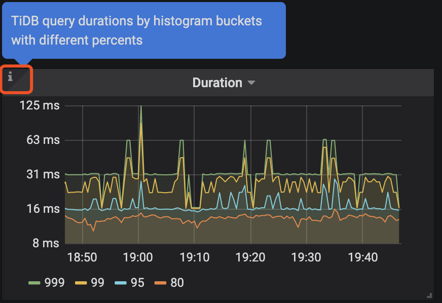

# 01 Release-2.1 升级到 Release-3.0 线上集群升级
> 李仲舒  2020 年 2 月 10 日


## 一、背景 / 目的

分布式数据库集群运维过程有一定的复杂性和繁琐性，3.0 版本是目前被广泛使用的版本，相比 2.1 有大幅度增加性能，以及很多新增的功能和特性，整体架构、配置也有较大的优化。该篇根据广大用户的升级经验，尽可能将 Release-2.1 升级到 Release-3.0 的准备工作、升级过程中注意事项、升级后重点关注列举详细，做到防患于未然。为 Release-3.0 版本的优秀特性和产品性能在业务场景中广泛使用提供文档依托。  


适用人群默认为熟悉 2.1 版本的使用，但是没有做过大版本升级。

## 二、操作前的 Check 项

### 2.1 备份原集群修改过的 TiDB、TiKV 和 PD 参数

> 创建临时目录，备份升级前的参数配置

```shell
mkdir -p /tmp/tidb_update_3.0/conf
mkdir -p /tmp/tidb_update_3.0/group_vars
```

> 确认并备份 tidb-ansible/conf/tidb.yml 中的参数

```shell
$cat tidb.yml |grep -v "#" |grep -v ^$ > /tmp/tidb_update_3.0/conf/tidb.yml
$cat /tmp/tidb_update_3.0/conf/tidb.yml
... 配置展示省略 ...
```

> 确认并备份 tidb-ansible/conf/tikv.yml 中的参数

```shell
$cat tikv.yml |grep -v "#" |grep -v ^$ > /tmp/tidb_update_3.0/conf/tikv.yml
$cat /tmp/tidb_update_3.0/conf/tikv.yml
... 配置展示省略 ...
```

> 确认并备份 tidb-ansible/conf/pd.yml 中的参数

```shell
$cat pd.yml |grep -v "#" |grep -v ^$ > /tmp/tidb_update_3.0/conf/tidb.yml
$cat /tmp/tidb_update_3.0/conf/pd.yml
... 配置展示省略 ...
```

> 确认并备份 PD 集群中 etcd 记录的 PD 配置信息

```shell
$cd tidb-ansible/resource/bin/
$./pd-ctl -u "http://{pd-ip}:{pd_client_port}" config show all > /tmp/tidb_update_3.0/conf/pd.json
$cat /tmp/tidb_update_3.0/conf/pd.json
... 配置展示省略 ...
```

> 确认并备份 TiDB、TiKV、PD、Grafana、Prometheus 等组件的组参数的变化，尤其是端口的变化

```shell
$cd tidb-ansible/group_vars
$ll |awk '{print $9}'|grep -v ^$
alertmanager_servers.yml
all.yml
drainer_servers.yml
grafana_servers.yml
importer_server.yml
lightning_server.yml
monitored_servers.yml
monitoring_servers.yml
pd_servers.yml
pump_servers.yml
tidb_servers.yml
tikv_servers.yml
$cp *.yml /tmp/tidb_update_3.0/group_vars/
```

## 三、升级前的注意事项

### 3.1  查看 TiDB 的 Release Notes

以 v3.0.9 [Release Notes](https://pingcap.com/docs-cn/stable/releases/3.0.9/) 为例，通过Release Notes了解做了那些优化或者修复了哪些 bug。

### 3.2 升级 3 个注意、2 个不支持、1 个用户

- 注意通知业务，升级期间可能会有偶尔的性能抖动，PD leader 升级可能会有 3s 的影响；

- 注意预估升级时间 = tikv 个数 \* 5 min（默认是 transfer leader 时间） + 10 min，滚动升级 TiKV 时间较长；

- 注意通知业务升级过程禁止操作 DDL，最好过一次完整的数据冷备份，通过 MyDumper 导出业务库；

- 整个升级过程不支持版本回退，目前未出现升级失败需要回退案例;

- 升级过程中不支持 DDL 操作，否则会有未定义问题，最终导致升级异常，影响业务；

- 升级操作通过中控机的 TiDB 管理用户完成，默认是 “tidb” 用户。

## 四、操作步骤

### 4.1 下载最新版的 v3.0.x 版本的 tidb-ansible

对应的 TAG 可以查看 Github 中的[ tidb-ansible 项目](https://github.com/pingcap/tidb-ansible/releases/tag/v3.0.9)，以 v3.0.9 为例，注意设置目录别名 `“tidb-ansible-v3.0.9”`

```shell
git clone -b v3.0.9 https://github.com/pingcap/tidb-ansible.git tidb-ansible-v3.0.9
```

tidb-ansible-v3.0.9 几个特殊的地方：

- 关于新增的 `excessive_rolling_update.yml` 和 `rolling_update.yml` 的关系。
  - 如果部署采用 （默认）systemd 模式 ，使用 `excessive_rolling_update.yml` 来进行滚动升级操作，原因是涉及到 [PD 滚动升级](https://github.com/pingcap/tidb-ansible/blob/v3.0.9/excessive_rolling_update.yml#L208-L211)（以 v3.0.9 为例）的代码变动，该脚本仅本次升级使用一次，以后再次升级到后续版本均由 `rolling_update.yml` 来完成。

     ```shell
     $ cat inventory.ini|grep supervision
     
     # process supervision, [systemd, supervise]
     
     process_supervision = systemd
     ```

  - 如果采用 supervise 模式，依然使用 rolling\_update.yml 来进行滚动升级操作。

     ```shell
     $ cat inventory.ini|grep supervision
     # process supervision, [systemd, supervise]
     process_supervision = supervise
     ```

- 新增 [config check](https://github.com/pingcap/tidb-ansible/blob/v3.0.9/rolling_update.yml#L57-L76) （以 v3.0.9 为例）,主要检查参数配置语法正确性。

```yml
## 代码块
- name: Pre-check PD configuration
  hosts: pd_servers[0]
  tags:
    - pd
  roles:
    - check_config_pd

- name: Pre-check TiKV configuration
  hosts: tikv_servers[0]
  tags:
    - tikv
  roles:
    - check_config_tikv

- name: Pre-check TiDB configuration
  hosts: tidb_servers[0]
  tags:
    - tidb
  roles:
    - check_config_tidb
```

### 4.2 更新 ansible 及依赖组件版本

```shell
# 验证版本是否符合要求
# 版本要求
$cat ./requirements.txt
ansible==2.7.11
jinja2>=2.9.6
jmespath>=0.9.0
# 检查版本
$ansible --version
$pip show jinja2
$pip show jmespath
# 卸载重新安装
# 卸载组件
$sudo pip uninstall ansible -y
$sudo pip uninstall jinja2 -y
$sudo pip uninstall jmespath -y
# 安装组件
$sudo pip install -r ./requirements.txt
```

### 4.3  编辑新 ansible 的 inventory.ini 和 配置

参考原始 inventory.ini 编辑新 inventory.ini 

```shell
$cd tidb-ansible-v3.0.9
# 按照 tidb-ansible/inventory.ini 配置
$vi inventory.ini
```

> 注意
> 
> 不要直接 cp 或者 mv 方式覆盖新的 inventory.ini 文件，建议将备份的原 tidb-ansible 的 inventory.ini 的配置参数通过复制、黏贴的方式将参数填写到新的 tidb-ansible 的 inventory.ini 配置文件中。另外注意以下几点：
- TiKV 单机多实例 
   -  TiKV 多实例部署时，必须添加 [tikv\_status\_port](https://pingcap.com/docs-cn/stable/how-to/upgrade/from-previous-version/#%E7%BC%96%E8%BE%91-tidb-%E9%9B%86%E7%BE%A4%E7%BB%84%E4%BB%B6%E9%85%8D%E7%BD%AE%E6%96%87%E4%BB%B6) 参数，同机上的多个实例注意区分端口，否则会造成监控缺失。
【功能介绍】监控数据到 Prometheus 从 push 模式调整为 pull 模式，TiKV 的启动脚本 `run_tikv.sh` 需要配置 `tikv_status_port`，需要在 inventory.ini 的 `[tikv_servers]` 主机组下的目标实例配置中添加参数 `tikv_status_port`，通过滚动升级才会将参数写入到 `run_tikv.sh` 中。

      ```yml
      vi tidb-ansible/inventory.ini
      ...省略上部分参数... 
      [tikv_servers]
      TiKV1-1 ansible_host=172.16.10.4 deploy_dir=/data1/deploy       tikv_port=20171 tikv_status_port=20181 labels="host=tikv1"
      TiKV1-2 ansible_host=172.16.10.4 deploy_dir=/data2/deploy       tikv_port=20172 tikv_status_port=20182 labels="host=tikv1"
      ...省略下部分参数...
      ```

   -  label 设置是否正确：

      - `[tikv_servers]` 主机组配置中同台主机多实例设置为相同的 host label ；

      - `[pd_servers:vars]` 下的 `locations_labels` 是否正确设置为 `locations_labels = [“host”]`；

- `enable_binlog` 是否开启  ,如果设置为 `True` ，升级过程中 Pump Server 会跟滚动升级操作一起升级，Drainer Server 需要单独完成升级操作。

- `deploy_dir` 和指定的参数（例如：端口、IP、别名）配置是否正确。

### 4.4  编辑 `group_vars` 文件

> **注意**
>
>不要直接 cp 或者 mv 方式覆盖新的 `group_vars` 目录下的 yml 文件，建议将原来 `group_vars` 下的 yml 文件分别和新的 `group_vars` 目录下的 yml 文件的配置参数对比，如果之前有做过参数调整，修改新的配置文件；如果默认的配置，可以忽略这个步骤。  

```shell
#按照 /tmp/tidb_update_3.0/group_vars 手动修改过的参数进行修改，如果没有变动，按照默认的配置。
$cd tidb-ansible-v3.0.9/group_vars
```

### 4.5  编辑 conf 文件

> 注意 
> 
> 不要直接 cp 或者 mv 方式覆盖新的 conf 目录下的 yml 文件，建议对比 /tmp/tidb_update_3.0/conf 下的 yml 配置文件 和 新的 conf 目录下的 yml 配置文件，将变化的参数进行修改，如果没有变动，按照默认的配置。另外，需要再额外关注以下几个变化的功能点的相关参数。

-  【功能介绍】开启共享 block-cache 

  - [storage.block-cache.capacity](https://github.com/pingcap/tidb-ansible/blob/v3.0.9/conf/tikv.yml#L124-L146) 默认开启共享池来自动调整，自动调整范围涵盖以下参数：rocksdb.defaultcf.block-cache-size，rocksdb.writecf.block-cache-size，rocksdb.lockcf.block-cache-size，raftdb.defaultcf.block-cache-size ，只需要在 tidb-ansible/conf/tikv.toml 设置 capacity，其他的 block-cache-size 参数不再需要手动设置。

  - 计算方法：capacity = \(MEM\_TOTAL \* 0.5 / TiKV 实例数量\)  
  
  ```yml
  vi tidb-ansible/conf/tikv.yml
  …省略上部分参数...
  storage:
    block-cache:
      capacity: "1GB"
  …省略下部分参数...
  ```

- 【功能介绍】开启[静默 region](https://github.com/tikv/tikv/blob/fa6e6d3eda27e7580a2c2e5ec88a8895d7b4cafb/docs/reference/configuration/raftstore-config.md#hibernate-region)，降低 region 心跳对 CPU 消耗 50%。 

  ```yml
  vi tidb-ansible/conf/tikv.yml
  ...省略上部分参数...
  raftstore:
    hibernate-regions: true
  ...省略下部分参数...
  ```

### 4.6  下载 TiDB binary

> **注意**
> 
> 该操作会从互联网中的 PingCAP 的介质服务器下载相应的版本 tar 包或者 binary 文件，下载的介质和对应的 tidb-ansible 版本一一对应，不建议版本差异化下载，例如使用 v3.0.9 的 tidb-ansible ，修改 inventory.ini 中的 tidb-version 配置，下载其他版本的 tidb binary 文件。 

```shell
$cd tidb-ansible-v3.0.9
$ansible-playbook local_prepare.yml
```

### 4.7  滚动升级

> **注意**
>
> 可以通过修改代码延长 Transfer leader 时间，来减少滚动 TiKV 过程的性能抖动。可以将 retries: 18 调整至 1800 。如果提前 transfer leader 完成以后，会停止 check ，继续下面的工作。延长 check 时间，也意味着升级时间会拉长，可以根据真实需求平衡参数。

```yml
# 以非 tls 模式为例
cd tidb-ansible-v3.0.9/common_tasks
vi add_evict_leader_scheduler.yml
...上部分代码忽略...
- name: check tikv's leader count
  uri:
    url: "http://{{ pd_addr }}/pd/api/v1/store/{{ store_id }}"
    method: GET
    return_content: yes
    body_format: json
    status_code: 200
  register: store_info
  until: (store_info.json.status.leader_count is defined and store_info.json.status.leader_count|int < 1) or store_info.json.status.leader_count is not defined
  retries: 18
  delay: 10
  failed_when: false
  when: not enable_tls|default(false)
...下部分代码忽略...
```

- 执行滚动升级脚本，顺序为 PD、TiKV、Pump、TiDB。

  - systemd 模式（默认）

> **注意**
>
> `excessive_rolling_update.yml` 仅限滚动升级 TiDB 集群使用一次，后面再次升级到其他版本均通过 `rolling_update.yml` 来完成。

```yml
$cd tidb-ansible-v3.0.9
$ansible-playbook excessive_rolling_update.yml
```

  - supervise 模式

```yml
$cd tidb-ansible-v3.0.9
$ansible-playbook rolling_update.yml
```

-  升级如果中间步骤报错退出，处理好问题后，可以利用 --tags 和 -l 跳过前面升级完的组件，继续后面的升级。举例：在升级 TiKV1-2 时报错，依次执行执行 ：

```shell
ansible-playbook excessive_rolling_update.yml --tags=tikv -l TiKV1-2,TiKV2-1,TiKV2-2 …

ansible-playbook excessive_rolling_update.yml --tags=pump (如果没开 binlog 可忽略）

ansible-playbook excessive_rolling_update.yml --tags=tidb
```

- 升级后会开启 [Region Merge](https://pingcap.com/docs-cn/stable/reference/tools/pd-control/)，减少空 Region 和小 Region 对 CPU 消耗，由于刚升级，之前堆积的需要 merge 的量会比较多，建议先调低并发到 2：

  ```yml
  ./pd-ctl -u "http://{pd-ip}:{pd_client_port}"
  » config set merge-schedule-limit 2
  Success!
  ```

- 等观察 region 数量趋于稳定后，再逐渐调大到 8

```shell
./pd-ctl -u "http://{pd-ip}:{pd_client_port}"
» config set merge-schedule-limit 8
Success!
» config set replica-schedule-limit 16
Success!
```

### 4.8. 滚动升级 TiDB 监控组件

> 注意
> 该操作会将 `Prometheus`、`Grafana`、`blackbox_exporter,node_exporter` 监控组件滚动升级，升级过程中 Grafana 页面会有一段时间不可用状态或者数据为空，看不到监控数据或者显示 `“no data”` 是预期的。

## 五、操作后 Check 监控项

登录 Grafana 页面 `http://{grafana-ip}:{grafana-port}` 用户名和密码：inventory.ini 有配置

- 查看 overview 页面， `Overview` 页面的 `Services Port Status` 状态是否均为绿色的 up 状态；


- 查看 TiDB 页面， `Query Summary` 监控栏的 `Duration、QPS`、`Statement OPS`、`QPS By Instance`、`Failed Query OPM` 监控项是否正常，在每个监控项左上↖️都会有一个“i” 光标放在那里会描述监控项的解释和预期情况；




- 查看 TiKV-Details 页面，TiKV 页面已经失效，新的监控数据主要会展示在 `TiKV-Details`、`TiKV-Summary`、`TiKV-Trouble-Shooting` 中。可以通过 TiKV-Details 页面，通过 `Cluster`、`Error`、`Server` 确认 TiKV 实例的状态的负载以及错误情况。

- 查看 PD 页面，查看 Cluster 监控栏中的 `Storage capacity`、`Current storage size`、`Current stroage used`、`Normal stores`、`Number of Regions` 确认当前集群存储数据和 Region 的情况，另外添加了 PD 参数展示和 Label 状态展示的监控。


- 出现以下监控告警可能是预期的 Region Merge 操作导致的，因为 v3.0 版本的 Region Merge 效果比 v2.1 要好，所以如果开启 Region Merge 并发调度，可能短时间会出现 `tikvclient_backoff_count error` 告警，同时 values 会逐渐减少。对业务几乎没有影响，如担心业务延迟可以现将并发调度调整为 0 ，等到业务低峰时候，再加大 Region Merge 并发度。

```conf
【样例】
TiDB tikvclient_backoff_count error
状态: 问题
cluster: xxx-cluster, instance: 172.16.1.1:10081, values:.2000000
2000000
2020-02-11 13:04
```

## 六、周边工具升级

### 6.1 tidb-binlog 升级

- tidb-binlog 按照 tidb-ansible 部署

  - pump 会更 TiDB Cluster 的滚动升级操作一同升级，升级过程对于正在增量同步的数据没有影响，升级完成以后，可以登录到目标的 pump 节点，确认 pump 的版本。

  ```shell
  $ ./pump -V
  Release Version: v3.0.9
  Git Commit Hash: c97e501d5054ed63c325c02b581a7c1a661cbd42
  Build TS: 2020-01-14 12:53:37
  Go Version: go1.13
  Go OS/Arch: linux/amd64
  ```

  - drainer 升级需要先将 drainer 的 binary 上传至目标的节点 ${deploy_dir}/bin 目录下，注意不要覆盖原 drainer ，可以参考下面的操作。

  ```shell
  $tidb-ansible/resources/bin
  $ ./drainer -V
  Release Version: v3.0.9
  Git Commit Hash: c97e501d5054ed63c325c02b581a7c1a661cbd42
  Build TS: 2020-01-14 12:53:50
  Go Version: go1.13
  Go OS/Arch: linux/amd64
  $cp drainer drainer309
  $scp drainer309 tidb@{drainer-ip}:${deploy_dir}/bin/
  $ssh {drainer-ip}
  $cd ${deploy_dir}/scripts
  $./stop_drainer.sh
  $mv ${deploy_dir}/bin/drainer ${deploy_dir}/bin/drainer.old
  $mv ${deploy_dir}/bin/drainer309 ${deploy_dir}/bin/drainer
  $./start_drainer.sh
  ```

### 6.2 Tispark 升级

- 目前 Tispark 不能直接通过 ansible 升级

- `local_prepare.yml`  会将 Tispark 和 spark binary 下载到中控机本地目录

  - 代码块

   ```yml
   
   tispark_packages:
     - name: spark-2.4.3-bin-hadoop2.7.tgz
       version: 2.4.3
       url: http://download.pingcap.org/spark-2.4.3-bin-hadoop2.7.tgz
       checksum:    "sha256:80a4c564ceff0d9aff82b7df610b1d34e777b45042e21e2d41f3e497bb1fa5d8"
     - name: tispark-latest.tar.gz
       version: latest
       url: http://download.pingcap.org/tispark-assembly-latest-linux-amd64.tar.gz
     - name: tispark-sample-data.tar.gz
       version: latest
       url: http://download.pingcap.org/tispark-sample-data.tar.gz
       checksum:    "sha256:bd0368a9d8663a4a8de89e39cc4cc1d91c718faf36d4bc7e1f8482c34d5bb8db"
   
   ```

  - 下载目录

    ```shell   
    $cd tidb-ansible-v3.0.9/downloads
    $ ll *spark*|awk '{print $9}'
    spark-2.4.3-bin-hadoop2.7.tgz
    tispark-core-2.1.8-spark_2.4-jar-with-dependencies.jar
    tispark-sample-data.tar.gz
    $pwd
    /home/tidb/lzs/ansible/
    ```

- 升级操作和 drainer 升级操作类似

  - 先停掉 Spark 服务

  - 将 Tispark 的 jar 包拷贝到spark安装目录下面的 jars 子目录

  - 启动 Spark 服务

  - 打开master web ui: `http://${master ip}:8080`，确认可以访问，确认work个数、core个数、内存数是否符合预期

  - 简单测试：`./bin/spark-shell --master spark://${master ip}:7077` 运行一些简单的测试命令，例如看看是否能访问tidb

## 七、升级常见问题

### 7.1  tidb-ansible 操作常见问题排查

- 通过 git 下载 tidb-ansible 分支和升级 TIDB 集群版本不匹配问题

  - 不建议多版本混用 tidb-ansible ，目前很多逻辑支持的都是当前版本，使用 tidb-ansible 版本和 tidb 集群版本一致。通过 git clone 下载指定的 tag 分支，inventory.ini 中的 tidb-version 参数不要擅自修改。

- 执行 `local_prepare.yml` 报错

  - 网络延迟高，导致部分 curl get 下载介质文件不完整或者中断报错；

  - 下载的介质文件异常，可以根据报错找到对应的脚本未知和下载的地址，通过 curl 命令进行下载验证。

- 执行 `rolling_update.yml` 报错

  - tikv 滚动过程中报错退出，确认具体的报错位置，查看对应的 ansible-playbook 逻辑

## 八、相关案例

Asktug 问题

- [https://asktug.com/t/topic/2126](https://asktug.com/t/topic/2126)

- [https://asktug.com/t/v2-1-4-v3-0-0-tikv-up/415](https://asktug.com/t/v2-1-4-v3-0-0-tikv-up/415)

- [https://asktug.com/t/topic/2280](https://asktug.com/t/topic/2280)

- [https://asktug.com/t/v2-1-9-v3-0-5-fatal-schema-1146-table-mysql-tidb-doesnt-exist/1616](https://asktug.com/t/v2-1-9-v3-0-5-fatal-schema-1146-table-mysql-tidb-doesnt-exist/1616)

- [https://asktug.com/t/tidbv2-1-1-v3-0-1/1638](https://asktug.com/t/tidbv2-1-1-v3-0-1/1638)

